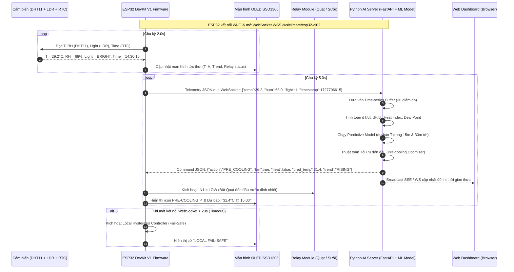

# POC AI-02: Hệ Thống Dự Báo & Tối Ưu Môi Trường Bằng Mô Hình AI Riêng (Predictive Climate Optimizer)

> **Mã Đề Tài:** AI-02  
> **Git Worktree & Branch:** `wt/poc/ai-02-predictive-climate-optimizer`  
> **Thư mục triển khai:** `pocs/poc-ai-02-predictive-climate-optimizer/`  
> **Tài liệu tham chiếu gốc:** [`docs/projects/PROJECT-CATALOG-AND-SPECS.md`](./PROJECT-CATALOG-AND-SPECS.md) (Mục 4.2)

---

## 1. Yêu Cầu Đề Tài (Requirements Analysis)

### 1.1 Bài toán và Ý nghĩa Thực tiễn
Các bộ điều hòa vi khí hậu hoặc rơ-le nhiệt truyền thống (Thermostat) hoạt động theo nguyên lý cơ học phản ứng thụ động (**Reactive Bang-Bang Control**): chỉ khi nhiệt độ thực tế vượt qua ngưỡng nóng (ví dụ $T > 30^\circ\text{C}$) thì quạt mới được bật. Tuy nhiên, phòng ốc và môi trường có **quán tính nhiệt lớn (Thermal Inertia)**; khi quạt bật thì nhiệt độ phòng vẫn tiếp tục tăng thêm trước khi hạ xuống (Overshoot), và quạt phải hoạt động liên tục hết công suất gây lãng phí điện năng và khó chịu cho người dùng.

**POC AI-02: Predictive Climate Optimizer** giải quyết triệt để vấn đề này bằng việc đưa mô hình Học máy / Dự báo chuỗi thời gian (**Time-series Predictive AI Model**) vào hệ sinh thái IoT:
- **Thu thập dữ liệu đa nguồn:** ESP32 đo định kỳ Nhiệt độ & Độ ẩm (DHT11), Cường độ ánh sáng môi trường (LDR LM393) và nhãn thời gian thực chuẩn xác (RTC DS3231/DS1307).
- **Phân tích xu hướng & Dự báo sớm:** Máy chủ AI (Python FastAPI) tiếp nhận chuỗi số liệu thời gian thực (Time-series Stream) qua giao thức WebSocket, tính toán đạo hàm biến thiên nhiệt ẩm ($\frac{\Delta T}{\Delta t}, \frac{\Delta H}{\Delta t}$), chỉ số nhiệt (Heat Index), điểm sương (Dew Point) và chạy mô hình hồi quy / học máy để dự báo xu thế vi khí hậu trong **15 - 30 phút tiếp theo**.
- **Điều khiển đón đầu (Pre-emptive Optimization):**
  - Khi mô hình dự báo nhiệt độ sẽ vượt ngưỡng oi bức trong 20 phút tới (ví dụ do nắng rọi vào phòng qua cảm biến LDR kết hợp đà tăng nhiệt độ), AI phát lệnh bật Relay Quạt sớm ở công suất/thời điểm thích hợp (**Pre-cooling**), triệt tiêu đỉnh nhiệt trước khi nó xảy ra, giúp không khí duy trì ổn định trong dải lý tưởng (Comfort Zone) và tiết kiệm đến 20-30% điện năng.
  - Khi mô hình nhận thấy nhiệt độ phòng bắt đầu đà giảm sâu, quạt được ngắt sớm trước khi gây lạnh buốt.
  - Dự báo nguy cơ đọng sương / nồm ẩm (Mold Alert: RH cao kèm điểm sương sát nhiệt độ mặt sàn) để kích hoạt thông gió hoặc hút ẩm.
- **Hiển thị trực quan thời gian thực:** Màn hình OLED 0.96" SSD1306 vẽ thông số tức thời, xu hướng nhiệt độ tương lai và trạng thái tối ưu của AI.
- **Fail-Safe tự hành:** Nếu mất kết nối với Cloud/AI Server, ESP32 tự động kích hoạt bộ điều khiển cục bộ (Local Hysteresis Fallback) để đảm bảo an toàn thiết bị.

### 1.2 Danh mục Thiết bị Phần cứng (Bộ Kit Sẵn Sàng 100%)
1. **1× Bo mạch vi điều khiển ESP32 DevKit V1 (30 chân).**
2. **1× Module Cảm biến Nhiệt độ & Độ ẩm DHT11 (Module 3 chân Kiểu A).**
3. **1× Module Cảm biến Quang trở LDR (LM393 3 chân / 4 chân).**
4. **1× Module Thời gian thực RTC (DS3231 hoặc DS1307).**
5. **1× Màn hình OLED 0.96 inch I2C (SSD1306 128×64).**
6. **1× Module Relay 2 kênh 5V (Optocoupler cách ly quang, Active LOW).**
7. **2× Đèn LED chỉ thị (Xanh lá - Comfort/Status, Đỏ/Vàng - Pre-cooling Alert) + 2× Điện trở 220Ω.**
8. **1× Nút bấm vật lý (Pushbutton 12×12mm) chuyển chế độ OLED / Manual Override.**
9. **Breadboard MB102 & Cáp nối Jumper.**

---

## 2. Kiến Trúc Phần Cứng & Bản Đồ Chân (Hardware Pinout Map)

Tuân thủ nghiêm ngặt **Quy chuẩn Xác thực Sơ đồ Chân Ngoại vi (Rule 7, AGENTS.md)** và đặc tính vật lý của **ESP32 DevKit V1 (30 chân)**:

| Chân ESP32 | Ký hiệu Bo Mạch Module Thực Tế | Chân Sơ Đồ Wokwi | Chức Năng Kỹ Thuật | Lưu Ý An Toàn & Thiết Kế |
|:---:|:---:|:---:|---|---|
| **GPIO 21** | **`SDA`** (OLED & RTC) | `oled1:SDA`, `rtc1:SDA` | Tuyến dữ liệu I2C chung | Mắc song song OLED (`0x3C`) và RTC (`0x68`) trên cùng bus I2C |
| **GPIO 22** | **`SCL`** (OLED & RTC) | `oled1:SCL`, `rtc1:SCL` | Tuyến xung Clock I2C chung | Nối song song 2 thiết bị I2C chuẩn công nghiệp |
| **GPIO 19** | **`S`** / `DAT` (DHT11) | `dht1:SDA` | Tuyến tín hiệu Single-Bus 1-Wire | Module 3 chân đã tích hợp trở pull-up 10kΩ. Không cắm nhầm chân `S` vào 3V3 |
| **GPIO 35** | **`DO`** (LDR Module LM393) | `ldr1:DO` | Ngõ vào số mức sáng/tối (LM393) | Thuộc kênh ADC1, chân Input-Only, an toàn tuyệt đối khi bật Wi-Fi |
| **GPIO 34** | **`AO`** (LDR Module 4-Pin / Tùy chọn) | `ldr1:AO` | Ngõ vào Analog đo độ sáng liên tục | Thuộc kênh ADC1 (0–4095), an toàn khi Wi-Fi bật |
| **GPIO 26** | **`IN1`** (Relay Kênh 1) | `relay1:IN` | Kích mở Quạt làm mát (Active LOW) | GPIO Output thông thường, an toàn không ảnh hưởng bootloader |
| **GPIO 27** | **`IN2`** (Relay Kênh 2) | `relay2:IN` | Kích mở Sưởi/Đèn/Rèm (Active LOW) | GPIO Output thông thường |
| **GPIO 25** | Chân nút bấm Pushbutton | `btn1:1.r` | Nút bấm chuyển màn hình OLED / Setup | Bật `INPUT_PULLUP` nội bộ, đầu kia nối GND |
| **GPIO 23** | Anode LED Xanh qua trở 220Ω | `r_comf:1` $\rightarrow$ `led_comf:A` | LED báo Comfort Zone / WiFi Link | Hạn dòng điện trở 220Ω nối tiếp |
| **GPIO 18** | Anode LED Vàng qua trở 220Ω | `r_warn:1` $\rightarrow$ `led_warn:A` | LED báo AI Pre-cooling Active / Alert | Hạn dòng điện trở 220Ω nối tiếp |
| **3V3** | **`VCC`** / **`+`** (DHT11, OLED, RTC, LDR) | `esp:3V3` | Cấp nguồn logic 3.3V ổn định | Đồng bộ mức điện áp 3.3V cho cảm biến và màn hình |
| **VIN (5V)** | **`VCC`** (Relay Module) | `relay1:VCC`, `relay2:VCC` | Cấp nguồn cuộn hút 5V cho Relay | Đảm bảo đủ lực hút tiếp điểm cuộn dây 5V |
| **GND** | **`GND`** / **`-`** | `esp:GND.1`, `esp:GND.2` | Nối đất toàn bộ hệ thống chung | Nối chung GND giữa ESP32, Relay, Sensor, LED |

---

## 3. Kiến Trúc Luồng Hoạt Động & Giao Thức (Architecture & Protocol)



### 3.1 Định dạng Gói tin WebSocket (JSON Schemas)

#### a. Telemetry từ ESP32 gửi lên AI Server (Upstream mỗi 5s)
```json
{
  "device_id": "esp32-ai02",
  "temperature": 29.2,
  "humidity": 68.0,
  "light_level": 1,
  "light_analog": 3250,
  "rtc_timestamp": 1727706615,
  "rtc_time_str": "14:30:15",
  "relay1_fan": false,
  "relay2_heat": false,
  "free_heap": 184520,
  "uptime_sec": 360
}
```

#### b. Lệnh Điều khiển & Dự báo từ AI Server gửi về ESP32 (Downstream)
```json
{
  "type": "climate_prediction",
  "predicted_temp_15m": 30.5,
  "predicted_temp_30m": 31.4,
  "trend": "RISING_FAST",
  "comfort_index": "WARNING_HEAT",
  "heat_index": 33.2,
  "dew_point": 22.8,
  "relay1_fan": true,
  "relay2_heat": false,
  "optimization_mode": "PRE_COOLING",
  "reason": "AI du bao tang +2.2C trong 30p do buc xa mat troi. Bat quat don dau!"
}
```

---

## 4. Mô Hình Toán Học & Giải Thuật AI (Predictive ML Engine)

Mô hình AI trên máy chủ thực hiện 3 tầng tính toán liên tục trên bộ đệm trượt $N = 30$ mẫu ($150\text{s}$ dữ liệu gần nhất):

1. **Tính toán Đạo hàm Biến thiên (Rate of Change):**
   $$\frac{\Delta T}{\Delta t} = \frac{\sum_{i=1}^k (t_i - \bar{t})(T_i - \bar{T})}{\sum_{i=1}^k (t_i - \bar{t})^2}$$
   Xác định tốc độ tăng/giảm nhiệt độ (°C/phút).

2. **Dự báo Nhiệt độ Xu hướng (Trend Extrapolation & Ridge Regression):**
   Mô hình kết hợp độ dốc quán tính nhiệt hiện tại cùng yếu tố bức xạ ánh sáng đo từ cảm biến LDR và thời gian trong ngày:
   $$T_{\text{pred}}(t + \Delta t) = T_t + \left(\frac{\Delta T}{\Delta t}\right) \cdot \Delta t + w_{\text{sun}} \cdot \text{LightFactor} - w_{\text{fan}} \cdot \text{FanStatus}$$

3. **Luật Ra Quyết Định Tối Ưu Năng Lượng Đón Đầu (Pre-emptive Actuation Rules):**
   - **Kích hoạt Làm mát Đón đầu (Pre-Cooling):**
     Nếu $T_{\text{pred}}(+30\text{m}) \ge 30.0^\circ\text{C}$ và $\frac{\Delta T}{\Delta t} > +0.1^\circ\text{C}/\text{min}$, kích hoạt bật Quạt ngay lập tức dù nhiệt độ hiện tại chỉ mới $28.5^\circ\text{C}$. Nhờ đó nhiệt độ phòng không bao giờ vượt qua ngưỡng khó chịu $30^\circ\text{C}$.
   - **Tắt Quạt Sớm (Early Cutoff):**
     Nếu Quạt đang bật và mô hình dự báo nhiệt độ sẽ hạ xuống dưới $25^\circ\text{C}$ trong 10 phút tới, ngắt Quạt sớm để tận dụng luồng khí lưu thông còn lại, tiết kiệm điện năng.
   - **Bảo vệ Chống Chập Chờn Rơ-le (Anti-Rapid Cycling Guard):**
     Đặt thời gian tối thiểu giữa 2 lần chuyển trạng thái của Relay là $60\text{s}$, tránh hư hại động cơ quạt khi nhiệt độ mấp mé ngưỡng.

---

## 5. Chiến Lược Mô Phỏng Wokwi & Dual-Target (Tuân thủ Rules 5 & 6)

1. **Hardware-First Dual-Target Rule (Rule 5):**
   - Môi trường `[env:esp32dev]` (mặc định): Biên dịch cho phần cứng thật với driver DHT11 (`DHT.h`), đọc RTC I2C (`RTClib.h` với `RTC_DS3231`/`RTC_DS1307`).
   - Môi trường `[env:wokwi]`: Biên dịch cho Wokwi Simulator với cờ `-DWOKWI_SIMULATION`, ánh xạ sang `wokwi-dht22` và `wokwi-ds1307`.
2. **Ghi nhãn trực quan đầy đủ trên `diagram.json` (Rule 6):**
   Mọi linh kiện trên canvas mô phỏng Wokwi đều được gắn label rõ ràng hiển thị chân GPIO và vai trò chức năng để ráp mạch đối chiếu 1-1.

---

## 6. Kế Hoạch Triển Khai Từng Bước (Phased Implementation Plan)

### Giai đoạn 1: Khởi tạo Cấu trúc Dự án & Sơ đồ Wokwi (Milestone 1)
- [ ] **Task 1.1:** Khởi tạo thư mục `pocs/poc-ai-02-predictive-climate-optimizer/` với cấu trúc chuẩn PlatformIO (`src/`, `include/`, `platformio.ini`, `wokwi.toml`, `diagram.json`, `README.md`).
- [ ] **Task 1.2:** Soạn thảo file cấu hình `platformio.ini` hỗ trợ môi trường kép `[env:esp32dev]` và `[env:wokwi]`, tích hợp các thư viện chuẩn: `Adafruit SSD1306`, `Adafruit GFX`, `RTClib`, `DHT sensor library`, `ArduinoJson`, `ArduinoWebsockets`.
- [ ] **Task 1.3:** Thiết kế sơ đồ mạch `diagram.json` đầy đủ các linh kiện: ESP32, DHT22, LDR LM393, RTC DS1307, OLED SSD1306, Relay 2 kênh, LED chỉ thị, Nút bấm. Gắn nhãn `attrs.label` đầy đủ theo Rule 6.
- [ ] **Task 1.4:** Xác thực cú pháp JSON của `diagram.json`.

### Giai đoạn 2: Xây dựng Backend Server AI & Mô hình Dự Báo (Milestone 2)
- [ ] **Task 2.1:** Khởi tạo thư mục `pocs/poc-ai-02-predictive-climate-optimizer/server/` với `requirements.txt` (FastAPI, Uvicorn, WebSockets, NumPy, Scikit-Learn, Jinja2).
- [ ] **Task 2.2:** Xây dựng module học máy `server/app/model.py`: Thuật toán Sliding Window Time-series, tính toán $\frac{\Delta T}{\Delta t}$, Heat Index, Dew Point, mô hình dự báo nhiệt độ $T_{\text{pred}}$ và bộ giải thuật tối ưu Pre-cooling.
- [ ] **Task 2.3:** Xây dựng WebSocket Hub & REST API trong `server/app/main.py`: Endpoint `/ws/climate/{device_id}` trao đổi dữ liệu JSON hai chiều với ESP32.
- [ ] **Task 2.4:** Thiết kế Web Dashboard thời gian thực (HTML5 Canvas / Chart.js) hiển thị biểu đồ nhiệt ẩm quá khứ, đường dự báo AI tương lai và trạng thái 2 kênh Relay.

### Giai đoạn 3: Phát triển Firmware ESP32 (Milestone 3)
- [ ] **Task 3.1:** Viết cấu hình `include/config.h` định nghĩa chân GPIO, hằng số I2C, khoảng thời gian lấy mẫu (`SAMPLE_INTERVAL_MS = 2000`, `TELEMETRY_INTERVAL_MS = 5000`).
- [ ] **Task 3.2:** Viết module đọc cảm biến (`sensors_manager`): Đọc non-blocking DHT11, đọc ngõ ra số LDR LM393 (`GPIO 35`), giao tiếp I2C đọc thời gian từ RTC DS3231/DS1307 (`GPIO 21/22`).
- [ ] **Task 3.3:** Viết module hiển thị OLED SSD1306 (`display_manager`): Giao diện 2 trang (Trang 1: Nhiệt độ, Độ ẩm, Cường độ sáng, Giờ RTC; Trang 2: Dự báo AI $T_{\text{pred}}$, Xu hướng Trend, Trạng thái Relay).
- [ ] **Task 3.4:** Viết module điều khiển Relay (`relay_controller`): Điều khiển 2 kênh Active LOW trên GPIO 26 & GPIO 27 kèm tính năng chống đóng ngắt giật cục (Minimum On/Off Protection).
- [ ] **Task 3.5:** Viết module WebSocket Client & Failsafe (`cloud_client`): Kết nối máy chủ AI, gửi telemetry JSON, phân tích gói tin dự báo điều khiển, và kích hoạt Local Fallback khi mất mạng.

### Giai đoạn 4: Kiểm Chứng & Biên Dịch Tự Động (Milestone 4 - Verification Gate)
- [ ] **Task 4.1:** Biên dịch kiểm tra tĩnh môi trường phần cứng thật: `pio run -d pocs/poc-ai-02-predictive-climate-optimizer -e esp32dev`.
- [ ] **Task 4.2:** Biên dịch kiểm tra môi trường giả lập: `pio run -d pocs/poc-ai-02-predictive-climate-optimizer -e wokwi`.
- [ ] **Task 4.3:** Xác thực sự tồn tại của file nhị phân `firmware.bin` và `firmware.elf`.
- [ ] **Task 4.4:** Kiểm tra mô phỏng Wokwi Serial Log, xác nhận các marker `[AI-02]`, `SENSORS_INIT_OK`, `OLED_INIT_OK`, `RTC_INIT_OK`, `TELEMETRY_SENT`, `AI_PREDICTION_RECEIVED`.

### Giai đoạn 5: Soạn thảo Tài liệu & Hướng Dẫn Vận Hành (Milestone 5)
- [ ] **Task 5.1:** Soạn thảo `pocs/poc-ai-02-predictive-climate-optimizer/README.md` theo chuẩn của repository, bao gồm Bảng phân bổ chân chi tiết, sơ đồ nguyên lý, hướng dẫn chạy máy chủ AI và các lệnh CLI thao tác.
- [ ] **Task 5.2:** Kiểm tra tuân thủ toàn bộ các nguyên tắc trong `AGENTS.md`.
