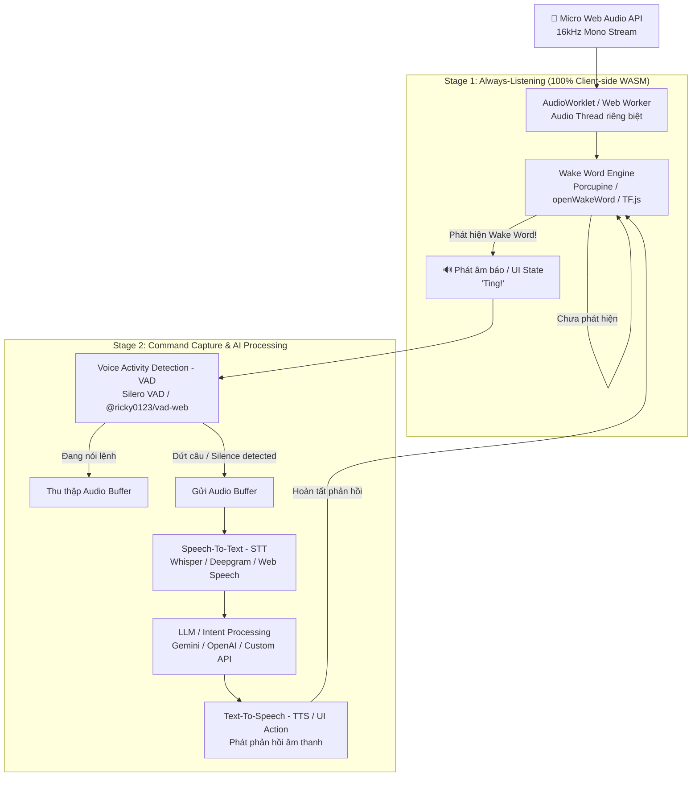

# Nghiên Cứu & Đặc Tả: Cơ Chế Always-Listening & Voice Wake-Up Trên Web Bằng JavaScript

Tài liệu này tổng hợp toàn bộ kết quả nghiên cứu chuyên sâu về giải pháp **luôn lắng nghe sự kiện âm thanh (Always-Listening / Voice Activation)** trên nền tảng Web Browser sử dụng JavaScript/TypeScript. Tài liệu phân tích kiến trúc 2 giai đoạn (2-Stage Pipeline), so sánh các thư viện hiện đại, giải quyết các rào cản trình duyệt và cung cấp hướng dẫn triển khai mã nguồn thực tế.

---

## 1. Bản Chất Kiến Trúc: Mô Hình 2 Giai Đoạn (2-Stage Voice Pipeline)

Một sai lầm phổ biến khi xây dựng trợ lý ảo trên Web là stream liên tục toàn bộ âm thanh về Cloud Server để nhận diện giọng nói. Cách tiếp cận này gây ra:
- **Tốn băng thông & chi phí khổng lồ:** Server phải liên tục xử lý luồng audio 24/7.
- **Độ trễ cao (High Latency):** Phụ thuộc hoàn toàn vào mạng internet.
- **Vi phạm quyền riêng tư (Privacy/GDPR):** Mọi cuộc hội thoại trong phòng đều bị gửi lên server.

Mô hình tiêu chuẩn công nghiệp (áp dụng bởi Apple Siri, Amazon Alexa, Google Assistant) được tinh chỉnh cho Web Browser như sau:



---

## 2. Bảng So Sánh Các Thư Viện JavaScript & Giải Pháp Kỹ Thuật

| Giải pháp | Cơ chế Engine | Độ trễ (Latency) | Mức tải CPU / RAM | Custom Wake Word | Chi phí / License | Đánh giá & Khuyến nghị |
| :--- | :--- | :--- | :--- | :--- | :--- | :--- |
| **Picovoice Porcupine** (`@picovoice/porcupine-web`) | WebAssembly + Web Worker | **Cực thấp** (< 20ms) | Rất nhẹ (< 2% CPU, ~2MB RAM) | Rất cao (Tự train qua Picovoice Console) | Miễn phí 3 user/tháng; Trả phí thương mại | 🏆 **Chuẩn công nghiệp Web:** Độ chính xác xuất sắc, không lag giao diện, tích hợp sẵn Audio Processor. |
| **openWakeWord** (`onnxruntime-web`) | ONNX Runtime Web (WASM / WebGL) | Thấp (~50 - 80ms) | Trung bình (~5% CPU, ~25MB RAM) | Cao (Tự train model ONNX xuất ra) | **100% Open-Source** (Apache 2.0) | **Lựa chọn mã nguồn mở số 1:** Hoàn toàn miễn phí, không phụ thuộc API key, chạy offline hoàn toàn. |
| **TensorFlow.js Speech Commands** (`@tensorflow-models/speech-commands`) | WebGL / WASM Backend | Trung bình (~120ms) | Khá nặng (~8-15% CPU) | Có (Hỗ trợ Transfer Learning trong trình duyệt) | **Open-Source** (Apache 2.0) | Do Google phát triển. Cho phép người dùng thu âm mẫu giọng trực tiếp trên web để train nhanh từ khóa. |
| **Silero VAD (Web)** (`@ricky0123/vad-web`) | ONNX Runtime Web | Cực nhanh (< 15ms) | Nhẹ (~2-3% CPU) | Không (Dùng cho Stage 2 để bắt đầu/kết thúc câu nói) | **Open-Source** (MIT) | 🏆 **Chuẩn VAD cho Web:** Thay thế hoàn hảo cho WebRTC VAD, lọc tạp âm cực tốt. |
| **Native Web Speech API** (`webkitSpeechRecognition`) | Trình duyệt gọi Cloud API (Google/Apple) | Rất cao (> 500ms) | Thấp (do server làm) | Không (Phải so khớp chuỗi Text) | Miễn phí theo trình duyệt | **Không khuyến khích cho Always-Listening:** Tự ngắt sau 5-10s im lặng, phụ thuộc mạng, không hỗ trợ Firefox. |

---

## 3. Kiến Trúc State Machine & Triển Khai Chi Tiết

Hệ thống hoạt động theo máy trạng thái hữu hạn (Finite State Machine - FSM):

```
[IDLE] ---> (User Click Bật Mic) ---> [LISTENING_WAKE_WORD]
                                              |
                                     (Phát hiện Wake Word)
                                              |
                                              v
                                       [RECORDING_COMMAND] (Silero VAD)
                                              |
                                     (Phát hiện im lặng 1.5s)
                                              |
                                              v
                                       [PROCESSING_AI] (STT -> LLM)
                                              |
                                     (Nhận câu trả lời)
                                              |
                                              v
                                       [SPEAKING_TTS]
                                              |
                                     (Phát xong âm thanh)
                                              |
                                              v
                                     [LISTENING_WAKE_WORD]
```

---

## 4. Hướng Dẫn Triển Khai Mã Nguồn Mẫu

### 4.1 Giải pháp 1: Picovoice Porcupine + Silero VAD (Production-Grade)

#### Bước 1: Cài đặt Dependencies
```bash
npm install @picovoice/porcupine-web @picovoice/web-voice-processor @ricky0123/vad-web onnxruntime-web
```

#### Bước 2: Module Xử lý Voice Activation (`voice-agent.js`)
```javascript
import { PorcupineWorker } from "@picovoice/porcupine-web";
import { WebVoiceProcessor } from "@picovoice/web-voice-processor";
import { MicVAD } from "@ricky0123/vad-web";

class VoiceAssistantManager {
  constructor(picovoiceKey) {
    this.picovoiceKey = picovoiceKey;
    this.porcupineWorker = null;
    this.vad = null;
    this.state = "IDLE"; // IDLE | WAKEWORD | COMMAND | PROCESSING | SPEAKING
  }

  // Khởi động sau khi người dùng click tương tác đầu tiên
  async init() {
    // 1. Khởi tạo Porcupine Wake Word Engine
    this.porcupineWorker = await PorcupineWorker.create(
      this.picovoiceKey,
      { builtin: "Jarvis" }, // Hoặc custom keyword object { publicPath: '/models/hey_siri.ppn', label: 'hey_siri' }
      (keywordLabel) => this.onWakeWordDetected(keywordLabel)
    );

    // 2. Khởi tạo Silero VAD cho Stage 2 (bắt lệnh người dùng)
    this.vad = await MicVAD.new({
      onSpeechStart: () => {
        if (this.state === "COMMAND") {
          console.log("[VAD] 🗣️ Người dùng bắt đầu nói lệnh...");
        }
      },
      onSpeechEnd: (audioFloat32Array) => {
        if (this.state === "COMMAND") {
          console.log("[VAD] 🤫 Đã dứt câu lệnh. Đang gửi xử lý...");
          this.processCommand(audioFloat32Array);
        }
      },
      positiveSpeechThreshold: 0.8,
      negativeSpeechThreshold: 0.8 - 0.15,
      minSpeechFrames: 5,
    });

    // 3. Bắt đầu luồng Always-Listening
    await this.startWakeWordListening();
  }

  async startWakeWordListening() {
    this.state = "WAKEWORD";
    console.log("[State] 🟢 Đang lắng nghe từ khóa kích hoạt...");
    await WebVoiceProcessor.subscribe(this.porcupineWorker);
  }

  async onWakeWordDetected(keywordLabel) {
    if (this.state !== "WAKEWORD") return;
    this.state = "COMMAND";
    console.log(`[WakeWord] ⚡ Đã kích hoạt từ khóa: ${keywordLabel}`);

    // Tạm dừng Wake Word engine để tránh kích hoạt lặp
    await WebVoiceProcessor.unsubscribe(this.porcupineWorker);

    // Phát âm thanh phản hồi UI 'Ting!'
    this.playTriggerSound();

    // Bật VAD để thu âm câu lệnh
    this.vad.start();
  }

  async processCommand(audioData) {
    this.state = "PROCESSING";
    this.vad.pause();

    try {
      // 1. Chuyển audioData (Float32Array 16kHz) thành WAV hoặc gửi trực tiếp qua WebSocket/API
      const transcript = await this.sendToSpeechToText(audioData);
      console.log(`[STT Output]: "${transcript}"`);

      // 2. Gửi sang LLM / Business Logic
      const aiResponse = await this.queryLLM(transcript);
      console.log(`[AI Response]: "${aiResponse}"`);

      // 3. Phát âm thanh TTS
      this.state = "SPEAKING";
      await this.speakResponse(aiResponse);
    } catch (error) {
      console.error("[Error] Lỗi xử lý chuỗi lệnh:", error);
    } finally {
      // Quay trở lại trạng thái luôn lắng nghe từ khóa
      await this.startWakeWordListening();
    }
  }

  playTriggerSound() {
    const audioCtx = new (window.AudioContext || window.webkitAudioContext)();
    const osc = audioCtx.createOscillator();
    const gain = audioCtx.createGain();
    osc.type = "sine";
    osc.frequency.setValueAtTime(880, audioCtx.currentTime); // Note A5
    osc.frequency.exponentialRampToValueAtTime(1760, audioCtx.currentTime + 0.15);
    gain.gain.setValueAtTime(0.3, audioCtx.currentTime);
    gain.gain.exponentialRampToValueAtTime(0.01, audioCtx.currentTime + 0.15);
    osc.connect(gain);
    gain.connect(audioCtx.destination);
    osc.start();
    osc.stop(audioCtx.currentTime + 0.15);
  }

  async sendToSpeechToText(audioData) {
    // Tích hợp Whisper API, Deepgram hoặc Web Speech API
    return "Mở phòng khách và bật điều hòa";
  }

  async queryLLM(prompt) {
    // Tích hợp Gemini API / OpenAI API
    return "Đã bật điều hòa phòng khách cho bạn.";
  }

  async speakResponse(text) {
    return new Promise((resolve) => {
      const utterance = new SpeechSynthesisUtterance(text);
      utterance.lang = "vi-VN";
      utterance.onend = () => resolve();
      window.speechSynthesis.speak(utterance);
    });
  }
}
```

---

### 4.2 Giải pháp 2: openWakeWord + ONNX Runtime Web (100% Open-Source)

Đối với các dự án yêu cầu mã nguồn mở hoàn toàn, `openWakeWord` có thể chạy trực tiếp trên trình duyệt thông qua `onnxruntime-web`.

*   **Pipeline Xử lý:**
    1. **AudioWorklet:** Trích xuất frame âm thanh 16kHz Float32 từ `getUserMedia`.
    2. **Mel-Spectrogram Generation:** Tính toán Spectrogram bằng WebAssembly (STFT + Mel Filterbank).
    3. **Embedding Model (`embedding_model.onnx`):** Biến đổi đặc trưng âm thanh thành vector embedding (1280 chiều).
    4. **Wake Word Classifier (`my_wakeword.onnx`):** Dự đoán xác suất từ khóa xuất hiện. Nếu `score > 0.5`, kích hoạt sự kiện.

---

## 5. Các Rào Cản Kỹ Thuật Trên Web Browser & Cách Giải Quyết

### 5.1 Rào Cản User Gesture (Autoplay & Mic Policy)
*   **Vấn đề:** Trình duyệt hiện đại chặn hoàn toàn việc tự động mở micro hoặc chạy `AudioContext` khi trang web vừa tải xong nếu người dùng chưa có thao tác tương tác (click, tap, keydown).
*   **Giải pháp:**
    - Thiết kế màn hình Onboarding hoặc nút bật trợ lý ảo: `"Nhấn để bật trợ lý giọng nói"`.
    - Sau sự kiện click, gọi `await AudioContext.resume()` và `navigator.mediaDevices.getUserMedia({ audio: true })`.

### 5.2 Giữ Luồng Âm Thanh Không Bị Nghẽn UI (Audio Thread Separation)
*   **Vấn đề:** Việc tính toán FFT và suy luận model ML liên tục có thể gây tụt khung hình (drop FPS) giao diện trang web.
*   **Giải pháp:**
    - Sử dụng **`AudioWorkletNode`** (chạy trên Real-time Audio Rendering Thread của OS) để buffer dữ liệu âm thanh.
    - Đẩy dữ liệu qua `postMessage()` vào **`Web Worker`** riêng biệt để chạy model ONNX/WASM.
    - Main UI Thread chỉ nhận callback `onWakeWord` để kích hoạt animation.

### 5.3 Hoạt Động Trong Tab Nền (Background Tab Throttling)
*   **Vấn đề:** Khi người dùng chuyển sang tab khác, trình duyệt sẽ giảm tần suất chạy của `setInterval` và `requestAnimationFrame` về mức 1 giây/lần.
*   **Giải pháp:** `AudioContext` và `AudioWorklet` thuộc luồng Multimedia thời gian thực nên **không bị throttle** bởi trình duyệt, giúp hệ thống tiếp tục lắng nghe từ khóa ngay cả khi người dùng đang làm việc ở tab khác.

### 5.4 Cấu Hình Xử Lý Âm Thanh Đầu Vào Tối Ưu (DSP Constraints)
Khi gọi `getUserMedia`, cấu hình các cờ DSP của phần cứng để tăng độ nhạy nhận diện:
```javascript
const stream = await navigator.mediaDevices.getUserMedia({
  audio: {
    channelCount: 1,
    sampleRate: 16000,
    echoCancellation: true,  // Triệt tiêu tiếng vọng từ loa máy tính
    noiseSuppression: true,  // Lọc tạp âm môi trường
    autoGainControl: true    // Tự động cân bằng độ lớn âm lượng
  }
});
```

---

## 6. Danh Mục Tài Liệu Tham Khảo Chính Thức

1. **Picovoice Porcupine Web SDK:**
   - Tài liệu chính thức: [https://picovoice.ai/docs/porcupine/](https://picovoice.ai/docs/porcupine/)
   - Mã nguồn GitHub: [https://github.com/Picovoice/porcupine/tree/master/binding/web](https://github.com/Picovoice/porcupine/tree/master/binding/web)
2. **openWakeWord Project (Open-Source KWS):**
   - Mã nguồn GitHub: [https://github.com/dscripka/openWakeWord](https://github.com/dscripka/openWakeWord)
   - Tài liệu ONNX Runtime Web: [https://onnxruntime.ai/docs/get-started/with-javascript/web.html](https://onnxruntime.ai/docs/get-started/with-javascript/web.html)
3. **Silero VAD (Voice Activity Detection):**
   - Thư viện `@ricky0123/vad-web`: [https://github.com/ricky0123/vad](https://github.com/ricky0123/vad)
   - Trang Demo & Benchmark: [https://test.vad.ricky0123.com/](https://test.vad.ricky0123.com/)
4. **TensorFlow.js Speech Commands:**
   - Tài liệu & Demo: [https://github.com/tensorflow/tfjs-models/tree/master/speech-commands](https://github.com/tensorflow/tfjs-models/tree/master/speech-commands)
5. **Tiêu Chuẩn MDN & W3C:**
   - MDN AudioWorklet: [https://developer.mozilla.org/en-US/docs/Web/API/AudioWorkletNode](https://developer.mozilla.org/en-US/docs/Web/API/AudioWorkletNode)
   - W3C Web Audio API Spec: [https://www.w3.org/TR/webaudio/](https://www.w3.org/TR/webaudio/)
