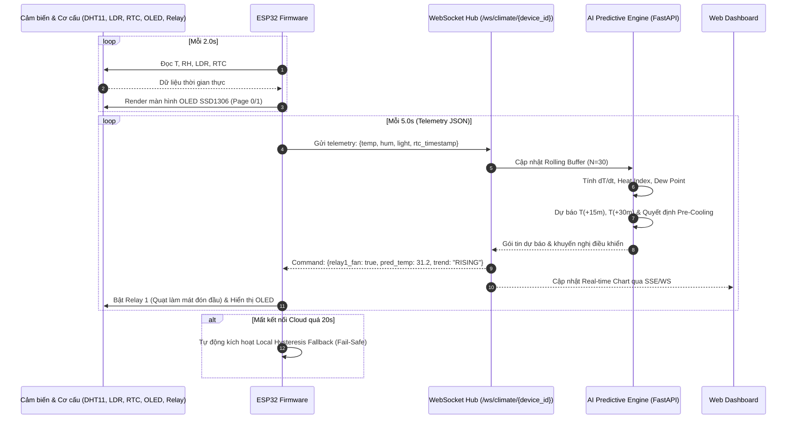

# POC AI-02: Hệ Thống Dự Báo & Tối Ưu Môi Trường Bằng Mô Hình AI Riêng (Predictive Climate Optimizer)

Proof of Concept (POC) triển khai hệ thống IoT điều hòa vi khí hậu thông minh đón đầu (**Pre-emptive Predictive Climate Control**) trên nền tảng **ESP32 DevKit V1 (30 chân)** kết hợp máy chủ AI (Python FastAPI) chạy mô hình chuỗi thời gian (**Time-series ML Engine**).

Thay vì cơ chế rơ-le nhiệt cơ học truyền thống (Bang-Bang Control: chỉ bật quạt khi phòng đã bị quá nhiệt), POC này tiếp nhận dữ liệu thời gian thực từ cảm biến **DHT11**, quang trở **LDR LM393** và đồng hồ thời gian thực **RTC DS3231/DS1307**, tính toán tốc độ biến thiên nhiệt ẩm ($\Delta T/\Delta t$) và dự báo sớm xu thế vi khí hậu trong **15 – 30 phút tới** để kích hoạt làm mát đón đầu (**Pre-cooling**), triệt tiêu đỉnh nhiệt và tiết kiệm điện năng.

---

## 1. Bảng Ánh Xạ Chân Ngoại Vi (Hardware Pinout Map)

Tuân thủ nghiêm ngặt **Quy chuẩn Xác thực Sơ đồ Chân Ngoại vi (Rule 7, AGENTS.md)**:

| Chân ESP32 DevKit V1 (30 chân) | Ký hiệu in trên Bo Mạch Module Thực Tế | Chân trên Sơ Đồ Wokwi (`diagram.json`) | Chức Năng Kỹ Thuật & Lưu Ý An Toàn |
|:---:|:---:|:---:|---|
| **GPIO 21** | **`SDA`** (OLED SSD1306 & RTC) | `oled1:SDA`, `rtc1:SDA` | **Tuyến I2C SDA dùng chung.** OLED (`0x3C`) và RTC (`0x68`) khác địa chỉ nên mắc song song hoàn toàn hợp lệ. |
| **GPIO 22** | **`SCL`** (OLED SSD1306 & RTC) | `oled1:SCL`, `rtc1:SCL` | **Tuyến I2C SCL dùng chung.** |
| **GPIO 19** | **`S`** / `DAT` (Module DHT11) | `dht1:SDA` | Giao tiếp 1-Wire Single-Bus. Module 3 chân Kiểu A (`S` - `+` - `-`) đã tích hợp sẵn điện trở pull-up 10kΩ. |
| **GPIO 35** | **`DO`** (Module LDR LM393) | `ldr1:DO` | Tín hiệu số TTL từ IC so sánh LM393. Thuộc kênh ADC1, chân Input-Only, an toàn tuyệt đối khi bật Wi-Fi. |
| **GPIO 34** | **`AO`** (Module LDR - Tùy chọn) | `ldr1:AO` | Ngõ vào Analog đọc độ sáng liên tục (0–4095) trên ADC1. |
| **GPIO 26** | **`IN1`** (Relay Kênh 1) | `relay1:IN` | Kích mở Quạt làm mát (Active LOW: `LOW` = BẬT quạt, `HIGH` = TẮT quạt). |
| **GPIO 27** | **`IN2`** (Relay Kênh 2) | `relay2:IN` | Kích mở Sưởi/Phụ trợ (Active LOW). |
| **GPIO 25** | Chân nút bấm Pushbutton | `btn1:1.r` | Chuyển trang màn hình OLED / Manual Toggle (`INPUT_PULLUP`, chân 2 nối GND). |
| **GPIO 23** | Anode LED Xanh qua trở 220Ω | `r_comf:1` $\rightarrow$ `led_comf:A` | LED báo Comfort Zone / WiFi Connected. Cathode nối GND. |
| **GPIO 18** | Anode LED Đỏ qua trở 220Ω | `r_warn:1` $\rightarrow$ `led_warn:A` | LED báo AI Pre-cooling Active / Alert. Cathode nối GND. |
| **3V3** | **`VCC`** / **`+`** (DHT11, OLED, RTC, LDR) | `esp:3V3` | Cấp nguồn ổn áp 3.3V logic an toàn cho toàn bộ cảm biến và màn hình. |
| **VIN** | **`VCC`** (Module Relay 2 kênh) | `relay1:VCC`, `relay2:VCC` | Cấp nguồn 5V cho cuộn hút rơ-le từ chân VIN (cổng USB). |
| **GND** | **`GND`** / **`-`** | `esp:GND.1`, `esp:GND.2` | Nối đất mass chung toàn hệ thống. |

> ⚠️ **Lưu ý an toàn module DHT11:** Không cắm nhầm chân `S` vào `3V3` và `+` vào GPIO. Module 3 chân trong kit thí nghiệm đã tích hợp sẵn điện trở pull-up 10kΩ.

---

## 2. Kiến Trúc Luồng Hoạt Động (Architecture)



---

## 3. Khởi Chạy Máy Chủ AI (FastAPI Server)

Từ thư mục `pocs/poc-ai-02-predictive-climate-optimizer/server`:

```bash
# 1. Tạo môi trường ảo và cài đặt thư viện
python3 -m venv .venv
source .venv/bin/activate
pip install -r requirements.txt

# 2. Khởi chạy máy chủ Uvicorn
uvicorn app.main:app --host 0.0.0.0 --port 8000
```

Các địa chỉ truy cập:
- **Web Dashboard thời gian thực:** `http://localhost:8000/`
- **Tài liệu API (Swagger UI):** `http://localhost:8000/docs`
- **WebSocket Endpoint cho ESP32:** `ws://<IP_MAY_TINH>:8000/ws/climate/esp32-ai02`

---

## 4. Quy Trình Kiểm Chứng CLI Tiêu Chuẩn (Dual-Target)

Tuân thủ nghiêm ngặt **Quy tắc Dual-Target (Rule 5)** và **Verification Pipeline (AGENTS.md)**:

### Bước 1: Xác thực cú pháp sơ đồ Wokwi
```bash
node -e 'JSON.parse(require("fs").readFileSync("pocs/poc-ai-02-predictive-climate-optimizer/diagram.json", "utf8"))'
```

### Bước 2: Biên dịch Firmware kép
```bash
# 1. Biên dịch cho bo mạch phần cứng thật (Cảm biến DHT11 & RTC thật - Mặc định)
pio run -d pocs/poc-ai-02-predictive-climate-optimizer -e esp32dev

# 2. Biên dịch cho môi trường giả lập Wokwi (Cảm biến ảo DHT22 & DS1307)
pio run -d pocs/poc-ai-02-predictive-climate-optimizer -e wokwi
```

### Bước 3: Xác nhận Binary Artifact
```bash
test -f pocs/poc-ai-02-predictive-climate-optimizer/.pio/build/esp32dev/firmware.bin && echo "ESP32DEV BIN OK"
test -f pocs/poc-ai-02-predictive-climate-optimizer/.pio/build/wokwi/firmware.bin && echo "WOKWI BIN OK"
```

### Bước 4: Kiểm thử tự động trên Wokwi Simulator
```bash
wokwi-cli --expect-text "BOOT_COMPLETE" --timeout 15000 pocs/poc-ai-02-predictive-climate-optimizer
```

---

## 5. Nạp Code Lên Board Thật (Hardware Flashing)

```bash
# 1. Tìm cổng USB Serial trên macOS
pio device list

# 2. Nạp firmware lên ESP32
pio run -d pocs/poc-ai-02-predictive-climate-optimizer -e esp32dev -t upload --upload-port /dev/cu.usbserial-XXXX

# 3. Mở Serial Monitor theo dõi quá trình gửi telemetry & nhận quyết định AI (115200 baud)
pio device monitor -p /dev/cu.usbserial-XXXX -b 115200
```

---

## 6. Kịch Bản Kiểm Thử & Nghiệm Thu Chức Năng

1. **Kiểm tra khởi động đa cảm biến:**
   - Quan sát log Serial: `[AI-02] SENSORS_INIT_OK`, `[AI-02] OLED_INIT_OK`, `[AI-02] RTC_INIT_OK`, `[AI-02] RELAY_INIT_OK`.
   - Màn hình OLED hiển thị màn hình khởi động rồi chuyển sang Page 0 hiển thị giờ RTC, nhiệt độ và độ ẩm.
2. **Kiểm tra chuyển trang OLED:**
   - Nhấn nút bấm trên **GPIO 25** $\rightarrow$ Màn hình OLED chuyển đổi mượt mà giữa **Page 0 (Tổng quan cảm biến)** và **Page 1 (AI Predictor & Trend)**.
3. **Thực nghiệm Làm Mát Đón Đầu (Pre-cooling Actuation):**
   - Đặt tay làm nóng cảm biến DHT11 hoặc thổi nhẹ khí ẩm nóng để nhiệt độ tăng dần từ 27°C lên 28.5°C.
   - Chiếu đèn vào quang trở LDR (DO = LOW).
   - Mô hình AI trên server ghi nhận tốc độ tăng $\Delta T/\Delta t > 0.08^\circ\text{C}/\text{min}$ và dự báo $T(+30\text{m}) \ge 30^\circ\text{C}$.
   - Máy chủ gửi lệnh `optimization_mode: PRE_COOLING`, Relay 1 (Quạt) đóng tiếp điểm kích hoạt làm mát đón đầu ngay lập tức, LED đỏ/vàng trên GPIO 18 bật sáng.
4. **Kiểm tra Cơ chế Tự Hành Cục Bộ (Local Hysteresis Fallback):**
   - Ngắt kết nối mạng hoặc tắt server AI.
   - Sau đúng 20 giây timeout, Serial hiển thị: `[AI-02] CANH BAO: Mat ket noi AI Server > 20s! Kich hoat che do tu hanh cuc bo`.
   - Màn hình OLED chuyển cờ trạng thái sang `[LOCAL]`, và thuật toán Hysteresis cục bộ tự động điều khiển bật/tắt quạt khi nhiệt độ vượt 30°C.
