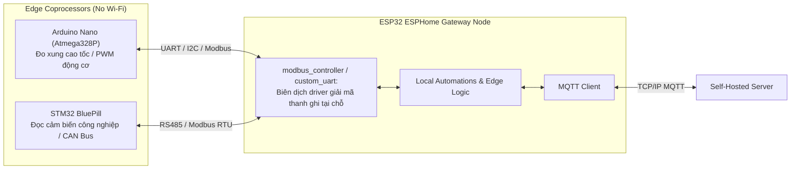

# POC-A — ESPHome Edge IoT: Compile-Time Configuration as Code (CaC)

> **Trường phái:** Compile-Time Tailored Architecture  
> **Giao thức:** Native MQTT Client hướng về Self-Hosted Server (Độc lập 100% với Home Assistant)  
> **Bo mạch mục tiêu:** ESP32 DevKit V1 (30 chân)

---

## 1. Triết Lý Cốt Lõi: Compile-Time Configuration as Code

ESPHome tiếp cận bài toán điều khiển thiết bị rìa (Edge IoT) theo nguyên lý:
1. **Pay-Only-For-What-You-Use:** Lập trình viên mô tả thiết bị bằng YAML cấp cao (`esphome.yaml`). Trình biên dịch chỉ trích xuất đúng mã nguồn C++ của các driver được khai báo (DHT11, GPIO Switch, Button Debounce), loại bỏ toàn bộ mã dư thừa.
2. **Edge Autonomy (Tự chủ tại biên):** Toàn bộ các tương tác cục bộ (ví dụ: nhấn nút `GPIO18` đảo trạng thái Relay `GPIO23`) được biên dịch thành mã máy chạy trực tiếp trong vi điều khiển với độ trễ siêu nhỏ (< 5ms). Khi mạng Wi-Fi hoặc Self-Hosted Server bị gián đoạn, thiết bị vẫn hoạt động bình thường mà không hề bị treo hay mất phản hồi.
3. **Độc lập Nền tảng:** Mặc dù được thiết kế tối ưu cho Home Assistant Native API, ESPHome hỗ trợ thành phần `mqtt:` gốc, cho phép kết nối trực tiếp đến bất kỳ máy chủ MQTT tự host nào mà không cần cài đặt Home Assistant.

---

## 2. Bảng Phân Bổ Chân Phần Cứng (ESP32 DevKit V1 30-Pin)

Mạch được thiết kế chuẩn hoá dùng chung 100% với POC-B (Tasmota):

| Chân ESP32 | Ký hiệu Bo mạch Thực tế | Linh kiện & Chức năng | Chân trên `diagram.json` | Lưu ý Kỹ thuật |
|:---:|:---:|---|:---:|---|
| **GPIO 23** | `D23` | Tải chấp hành (LED Đỏ / Relay) | `rLed:1` -> `ledActuator:A` | Mắc nối tiếp điện trở hạn dòng 220Ω |
| **GPIO 18** | `D18` | Nút nhấn tại chỗ (Local Toggle) | `btnToggle:1.l` | Cấu hình `INPUT_PULLUP`, nhấn nối GND |
| **GPIO 19** | `D19` | Cảm biến Môi trường (DHT11 Data) | `dht1:SDA` | Kéo lên 3.3V (Module có trở kéo sẵn) |
| **GPIO 32** | `D32` | Cảm biến Ngõ vào Analog | `pot1:SIG` | Thuộc **ADC1**, an toàn tuyệt đối khi bật Wi-Fi |
| **3V3 & GND**| `3V3`, `GND` | Nguồn cấp hệ thống | `esp:3V3`, `esp:GND` | Điện áp danh định 3.3V |

---

## 3. Mở Rộng Sang Các Dòng Edge Board Khác (Arduino Nano, STM32...)

Làm thế nào triết lý **Compile-Time CaC** của ESPHome áp dụng vào các vi điều khiển không có Wi-Fi như **Arduino Nano (ATmega328P)** hay **STM32 (ARM Cortex-M)**?



- **Mô hình Khai báo Thanh ghi:** Thay vì viết code C++ giao tiếp byte-by-byte phức tạp, bạn khai báo các thanh ghi Modbus/I2C của Arduino Nano/STM32 trực tiếp trong YAML (`modbus_controller:`).
- **Compile-Time Entity Mapping:** ESPHome tự động sinh mã giải mã kiểu dữ liệu (Float32, Int16, Bitmask) tại thời điểm build, biến một thanh ghi trong bộ nhớ của STM32 thành một `sensor` hoặc `switch` có đầy đủ bộ lọc, ngưỡng cảnh báo và gửi lên Server tự host.

---

## 4. Hướng Dẫn Kiểm Thử & Biên Dịch CLI

### 4.1 Biên dịch bằng ESPHome CLI
```bash
# 1. Cài đặt esphome (nếu dùng python venv)
pip install esphome

# 2. Kiểm tra cú pháp YAML
esphome config pocs/poc-esphome-edge/esphome.yaml

# 3. Biên dịch firmware
esphome compile pocs/poc-esphome-edge/esphome.yaml
```

### 4.2 Biên dịch bằng PlatformIO (Companion C++)
```bash
# Biên dịch cho phần cứng thật (DHT11)
pio run -d pocs/poc-esphome-edge -e esp32dev

# Biên dịch cho giả lập Wokwi (DHT22)
pio run -d pocs/poc-esphome-edge -e wokwi
```

### 4.3 Kiểm tra Cú pháp Sơ đồ Mạch
```bash
node -e 'JSON.parse(require("fs").readFileSync("pocs/poc-esphome-edge/diagram.json", "utf8"))'
```
