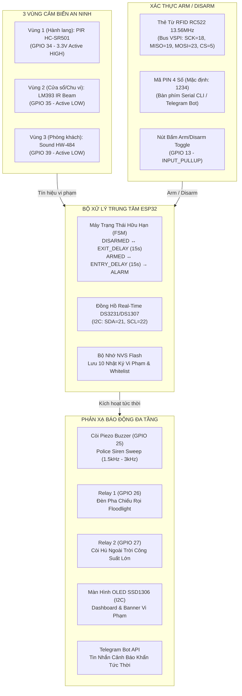

# POC SMH-01: Hệ Thống An Ninh Giám Sát Đa Vùng Cảnh Báo Tức Thời (Multi-Zone Defense System)

Proof of Concept (POC) triển khai giải pháp an ninh bảo vệ toàn diện ngôi nhà với **3 vùng giám sát vật lý độc lập**, cơ chế kiểm soát truy cập xác thực kép (**RFID RC522 13.56MHz + Mã PIN**), hệ thống phản xạ báo động đa tầng (**Còi hú cảnh sát, Đèn pha Floodlight & Còi công suất lớn qua Relay 2 kênh, Màn hình OLED SSD1306, Đồng hồ RTC DS3231/DS1307**) và **Cảnh báo tức thời qua Telegram Bot** trên vi điều khiển **ESP32 DevKit V1 (30 chân)**.

---

## 1. Cấu Trúc 3 Vùng An Ninh & Nguyên Lý Hoạt Động



### 1.1 Chi Tiết 3 Vùng Giám Sát
- **Vùng 1 (Hành lang - Indoor):** Cảm biến chuyển động hồng ngoại thụ động **PIR HC-SR501**. Khi phát hiện bức xạ thân nhiệt di chuyển, chân `OUT` xuất mức điện áp 3.3V TTL (Active HIGH) nối vào **GPIO 34**.
- **Vùng 2 (Cửa sổ / Ban công - Perimeter):** Module tránh vật cản / tia rào cản hồng ngoại **LM393 IR Sensor**. Khi tia bị che hoặc vật cản xâm phạm ranh giới, chân `OUT` tụt xuống 0V (Active LOW) nối vào **GPIO 35**.
- **Vùng 3 (Phòng khách / Khu vực cửa chính - Acoustic Breach):** Module cảm biến âm thanh **HW-484**. Khi có tiếng đập phá kính hoặc cậy khóa vượt ngưỡng, chân `DO` kéo xuống 0V (Active LOW) nối vào **GPIO 39 (VN)**. *Lưu ý:* Vùng 3 là vùng xâm nhập khẩn cấp nên sẽ kích hoạt còi báo động **ALARM tức thời mà không qua thời gian trễ Entry Delay!*

### 1.2 Cơ Chế Bật/Tắt Bảo Vệ (Arm/Disarm) & Thời Gian Trễ
1. **Xác thực RFID RC522:** Quẹt thẻ Master (mặc định UID `DE:AD:BE:EF`) hoặc thẻ người dùng đã lưu trong NVS để chuyển đổi Arm/Disarm.
2. **Xác thực mã PIN:** Gõ lệnh `d 1234` trên Serial Terminal hoặc gửi tin nhắn Telegram.
3. **Exit Delay (15 giây):** Sau khi Arm, hệ thống cho phép gia chủ 15s để rời khỏi nhà, còi bíp nhịp 1s/lần và đèn đỏ nhấp nháy chậm.
4. **Entry Delay (15 giây):** Khi mở cửa vào nhà ở chế độ Arm, hệ thống đếm ngược 15s với còi bíp dồn dập (3 tiếng/s) để người nhà quẹt thẻ trước khi kích nổ còi hú và đèn pha công suất cao.

---

## 2. Bản Đồ Nối Dây Phần Cứng Đối Chiếu 1-1 (Hardware Pinout Map)

> ⚠️ **Quy chuẩn An toàn Bắt buộc:**
> - Cảm biến PIR HC-SR501 **bắt buộc cấp nguồn 5V từ chân VIN** (IC BISS0001 yêu cầu $\ge 4.5\text{V}$).
> - Module RFID RC522 **bắt buộc cấp nguồn 3.3V từ chân 3V3** (tuyệt đối không cấp 5V sẽ gây nổ/cháy IC MFRC522).
> - Mọi LED rời mắc nối tiếp qua **điện trở 220Ω** để hạn dòng an toàn cho chân GPIO.

| Chân ESP32 DevKit V1 (30 Pin) | Ký hiệu in trên Bo mạch Module | Chân Wokwi (`diagram.json`) | Giao thức / Logic | Chức năng kỹ thuật & An toàn |
| :--- | :--- | :--- | :--- | :--- |
| **VIN (5V)** | `VCC` (PIR, Relay, RTC) | `esp:VIN` | Power 5V | Cấp nguồn 5V cho IC PIR BISS0001, cuộn hút Relay và RTC |
| **3V3 (3.3V)** | `VCC / 3.3V` (RC522, OLED, IR, Sound) | `esp:3V3` | Power 3.3V | Cấp nguồn logic 3.3V an toàn chống quá áp |
| **GND** | `GND` (Toàn bộ module) | `esp:GND.1 / GND.2` | Ground | Mass chung toàn hệ thống |
| **GPIO 34** | `OUT` trên Module PIR HC-SR501 | `esp:D34` | Input-Only (Active HIGH) | Ngõ vào đọc chuyển động thân nhiệt Vùng 1 |
| **GPIO 35** | `OUT / DO` trên Module IR LM393 | `esp:D35` | Input-Only (Active LOW) | Ngõ vào đọc cắt tia hồng ngoại Vùng 2 (kèm trở kéo 10k) |
| **GPIO 39 (VN)** | `DO` trên Sound Sensor HW-484 | `esp:VN` | Input-Only (Active LOW) | Ngõ vào đọc âm thanh vỡ kính Vùng 3 (kèm trở kéo 10k) |
| **GPIO 13** | Nút bấm cơ khí 12×12 | `esp:D13` | INPUT_PULLUP (Active LOW) | Nút bấm chuyển nhanh chế độ Arm/Disarm tại chỗ |
| **GPIO 21** | `SDA` (OLED SSD1306 & RTC DS1307) | `esp:D21` | I2C Data (Shared) | Đường dữ liệu bus I2C (OLED: `0x3C`, RTC: `0x68`) |
| **GPIO 22** | `SCL` (OLED SSD1306 & RTC DS1307) | `esp:D22` | I2C Clock (Shared) | Xung nhịp bus I2C chuẩn 400kHz |
| **GPIO 18** | `SCK` trên Module RFID RC522 | `esp:D18` | SPI SCK | VSPI Clock phần cứng |
| **GPIO 19** | `MISO` trên Module RFID RC522 | `esp:D19` | SPI MISO | VSPI Dữ liệu từ thẻ về ESP32 |
| **GPIO 23** | `MOSI` trên Module RFID RC522 | `esp:D23` | SPI MOSI | VSPI Dữ liệu từ ESP32 sang RC522 |
| **GPIO 5** | `SDA (CS)` trên Module RFID RC522 | `esp:D5` | SPI Chip Select | Kích chọn module RFID RC522 |
| **GPIO 4** | `RST` trên Module RFID RC522 | `esp:D4` | Digital Output | Reset phần cứng module RFID RC522 |
| **GPIO 25** | Cực (+) Còi Piezo Buzzer | `esp:D25` | Output (PWM/Tone) | Còi phát tín hiệu bíp trễ và âm điệu cảnh sát (1.5k–3kHz) |
| **GPIO 26** | `IN1` trên Module Relay 2 Kênh | `esp:D26` | Output (Active LOW) | Đóng ngắt tiếp điểm Đèn pha chiếu rọi (Floodlight) |
| **GPIO 27** | `IN2` trên Module Relay 2 Kênh | `esp:D27` | Output (Active LOW) | Đóng ngắt tiếp điểm Còi hú ngoài trời công suất cao |
| **GPIO 2** | Anode (+) LED Đỏ (qua trở 220Ω) | `esp:D2` | Output | Đèn LED cảnh báo / Strobe chớp nháy dồn dập |
| **GPIO 15** | Anode (+) LED Xanh (qua trở 220Ω) | `esp:D15` | Output | Đèn LED báo hệ thống đang an toàn (DISARMED) |

---

## 3. Danh Mục Lệnh Dòng Lệnh Tiêu Chuẩn (CLI-First Workflow)

### 3.1 Kiểm Tra Cú Pháp Sơ Đồ Mạch (Wokwi Lint)
```bash
# Kiểm tra tính hợp lệ của cấu trúc JSON
node -e 'JSON.parse(require("fs").readFileSync("pocs/poc-smh-01-multizone-defense-system/diagram.json", "utf8"))'

# Kiểm tra cú pháp part name và pin connection bằng Wokwi CLI
wokwi-cli lint pocs/poc-smh-01-multizone-defense-system
```

### 3.2 Biên Dịch Firmware
```bash
# 1. Biên dịch môi trường bo thật (Hardware-First)
pio run -d pocs/poc-smh-01-multizone-defense-system -e esp32dev

# 2. Biên dịch môi trường mô phỏng Wokwi
pio run -d pocs/poc-smh-01-multizone-defense-system -e wokwi

# 3. Xác nhận tính toàn vẹn của file nhị phân (Binary Artifacts)
test -f pocs/poc-smh-01-multizone-defense-system/.pio/build/esp32dev/firmware.bin && echo "Firmware BIN OK"
test -f pocs/poc-smh-01-multizone-defense-system/.pio/build/esp32dev/firmware.elf && echo "Firmware ELF OK"
```

### 3.3 Nạp Lên Board ESP32 Thật & Mở Serial Monitor
```bash
# 1. Liệt kê cổng kết nối trên macOS
pio device list

# 2. Nạp firmware lên ESP32 DevKit V1
pio run -d pocs/poc-smh-01-multizone-defense-system -e esp32dev -t upload --upload-port /dev/cu.usbserial-XXXX

# 3. Mở Serial Monitor với baudrate 115200
pio device monitor -p /dev/cu.usbserial-XXXX -b 115200
```

---

## 4. Hướng Dẫn Thao Tác Kiểm Thử & Menu Lệnh Serial CLI

Khi mở Serial Monitor (115200 baud), hệ thống cung cấp giao diện tương tác tức thời:

```text
==================================================
  POC SMH-01: MULTI-ZONE DEFENSE SYSTEM
  ESP32 DevKit V1 (30-pin) | PlatformIO CLI
==================================================
[POST] Chay kiem tra phan cung khoi dong...
[RTC] Module RTC DS1307/DS3231 ket noi thanh cong!
[OLED] Khoi tao SSD1306 thanh cong!
[RFID] MFRC522 Firmware Version: 0x12
[RFID] Khoi tao thanh cong! San sang quet the tu 13.56MHz.
[SMH-01] SYSTEM READY! Multi-Zone Defense Active.

==================================================
   MENU DIEU KHIEN DONG LENH SERIAL CLI (SMH-01)
==================================================
  a       : Kich hoat che do Bao Ve (ARM)
  d [pin] : Giai tru bao ve (DISARM, mac dinh PIN: 1234)
  1       : Gia lap vi pham Vung 1 (PIR Hanh lang)
  2       : Gia lap vi pham Vung 2 (IR Cua so/Hang rao)
  3       : Gia lap vi pham Vung 3 (Am thanh vo kinh)
  l       : Xem danh sach Nhat ky su kien (Audit Logs)
  c       : Xoa toan bo nhat ky trong NVS
  s       : Xem trang thai tong the he thong
  ?       : In menu tro giup nay
==================================================
```

### Kịch Bản Kiểm Thử Nhanh (Step-by-Step Test Scenarios):
1. **Kiểm tra Kích Hoạt Bảo Vệ (Arming):**
   - Quẹt thẻ RFID ảo hoặc nhấn phím `a` trên bàn phím.
   - Quan sát: Hệ thống đếm ngược 15s (`EXIT DELAY`), còi bíp nhịp 1s, đèn đỏ nhấp nháy chậm.
   - Hết 15s: Hệ thống chuyển sang `ARMED`, đèn đỏ sáng tĩnh, OLED hiển thị trạng thái tuần tra.
2. **Kiểm tra Đột Nhập Vùng 1 hoặc Vùng 2 (Entry Delay):**
   - Nhấn phím `1` (giả lập PIR) hoặc phím `2` (giả lập IR).
   - Quan sát: Hệ thống kích hoạt `ENTRY DELAY` (15s), còi bíp nhịp nhanh dồn dập (3 tiếng/giây).
   - Nếu trong 15s quẹt thẻ Master hoặc gõ `d 1234` -> Giải trừ thành công, còi tắt, chuyển về `DISARMED`.
   - Nếu không giải trừ -> Hết 15s chuyển sang `ALARM`: Relay 1 đóng bật đèn pha, Relay 2 đóng bật còi hú ngoài trời, còi Piezo hú Police Siren, đèn đỏ chớp Strobe và lưu log vào NVS.
3. **Kiểm tra Đột Nhập Vùng 3 (Khẩn cấp vỡ kính):**
   - Ở chế độ `ARMED`, nhấn phím `3` (giả lập Sound).
   - Quan sát: Hệ thống bỏ qua Entry Delay, kích nổ `ALARM` ngay lập tức!
4. **Kiểm tra Nhật Ký Sự Kiện (Audit Trail):**
   - Nhấn phím `l` để xuất danh sách lịch sử vi phạm có gắn mốc thời gian thực từ RTC.
