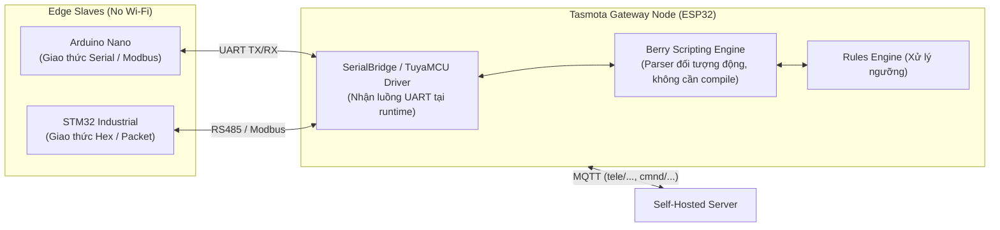

# POC-B — Tasmota Edge IoT: Runtime Monolith & Template-Driven Architecture

> **Trường phái:** Pre-compiled Monolithic Runtime Engine  
> **Giao thức:** Chuẩn MQTT Công nghiệp (`tele/`, `cmnd/`, `stat/`) kết nối Self-Hosted Server  
> **Bo mạch mục tiêu:** ESP32 DevKit V1 (30 chân)

---

## 1. Triết Lý Cốt Lõi: Runtime Monolith & Zero-Toolchain

Khác biệt hoàn toàn với ESPHome (bắt buộc phải biên dịch C++ mỗi khi đổi một chân GPIO), Tasmota tiếp cận việc điều khiển Edge IoT theo triết lý:
1. **Zero-Toolchain Deployment:** Người dùng chỉ cần nạp duy nhất một file binary phổ quát (`tasmota32.factory.bin`) chứa sẵn hàng trăm driver (DHT, BME, Relay, Buttons, I2C, SPI, Modbus, Berry). Không cần cài đặt PlatformIO, Python compiler hay GCC.
2. **Dynamic Runtime Configuration:** Mọi thiết lập phần cứng (Relay ở chân nào, cảm biến ở chân nào) đều được cấu hình động tại thời gian chạy (Runtime) thông qua chuỗi **JSON Template** hoặc **Web Console** mà không cần recompile hay nạp lại firmware.
3. **Rules Engine & Berry Scripting:** Logic tự động hóa cục bộ (Edge Autonomy) được cấu hình bằng các câu lệnh `Rule` hoặc ngôn ngữ kịch bản hướng đối tượng `Berry` (trên ESP32). Thay đổi logic áp dụng ngay lập tức sau 1 giây!

---

## 2. Bảng Phân Bổ Chân Phần Cứng (ESP32 DevKit V1 30-Pin)

Mạch điện hoàn toàn tương thích và dùng chung 100% breadboard với POC-A (ESPHome):

| Chân ESP32 | Ký hiệu Bo mạch Thực tế | Linh kiện & Chức năng | Mã Driver trong Template Tasmota | Ghi chú Kỹ thuật |
|:---:|:---:|---|:---:|---|
| **GPIO 23** | `D23` | Tải chấp hành (LED Đỏ / Relay) | `Relay1 (224)` | Kéo xuống GND qua điện trở 220Ω |
| **GPIO 18** | `D18` | Nút nhấn tại chỗ (Local Toggle) | `Button1 (32)` | Cấu hình `INPUT_PULLUP`, nhấn nối GND |
| **GPIO 19** | `D19` | Cảm biến Môi trường (DHT11 Data) | `DHT11 (1216)` | Kéo lên 3.3V (Đọc nhiệt độ/độ ẩm) |
| **GPIO 32** | `D32` | Cảm biến Ngõ vào Analog | `ADC Input (4704)` | Thuộc **ADC1**, đo điện áp analog |
| **3V3 & GND**| `3V3`, `GND` | Nguồn cấp hệ thống | `Nguồn 3.3V / GND` | Điện áp danh định 3.3V |

---

## 3. Mở Rộng Sang Các Dòng Edge Board Khác (Arduino Nano, STM32...)

Làm thế nào triết lý **Runtime Monolith** của Tasmota áp dụng vào các vi điều khiển không có Wi-Fi như **Arduino Nano (ATmega328P)** hay **STM32**?



- **SerialBridge & TuyaMCU:** Tasmota tích hợp sẵn driver `TuyaMCU` và `SerialBridge`. Bạn chỉ cần gán chân `GPIO16 = Serial TX` và `GPIO17 = Serial RX` trên Web UI, sau đó dùng lệnh runtime:
  ```text
  TuyaMCU 11,1   # Ánh xạ DP ID 1 của STM32/Nano sang Relay 1 của Tasmota
  ```
- **Berry Scripting Engine (ESP32):** Thay vì phải sửa source code C++, bạn viết một đoạn script Berry ngắn tải lên hệ thống tệp LittleFS. Script này sẽ lắng nghe UART từ STM32, parse bản tin nhị phân và phát hành thẳng lên MQTT topic mà không cần biên dịch lại firmware.

---

## 4. Hướng Dẫn Vận Hành & Kiểm Thử CLI

### 4.1 Kiểm thử qua Simulator (Không cần bo mạch thật)
Thư mục cung cấp trình mô phỏng thiết bị rìa Tasmota độc lập viết bằng Python (`simulate_tasmota_node.py`), triển khai chính xác 100% chuẩn giao thức MQTT của Tasmota:

```bash
# Chạy simulator kết nối đến Self-Hosted Server (port 1883)
python3 pocs/poc-tasmota-edge/scripts/simulate_tasmota_node.py --host 127.0.0.1 --port 1883
```

Khi chạy, simulator sẽ:
1. Kết nối MQTT và gửi gói `tele/edge_tasmota/LWT` -> `Online`
2. Định kỳ phát hành `tele/edge_tasmota/STATE` và `tele/edge_tasmota/SENSOR` (JSON chứa DHT11)
3. Lắng nghe lệnh điều khiển tại `cmnd/edge_tasmota/POWER` từ AI Server và phản hồi trạng thái tức thì tại `stat/edge_tasmota/POWER`
4. Kích hoạt `Rule 2` tự động bật tải tại biên khi nhiệt độ vượt 32°C!

### 4.2 Nạp và Cấu hình trên Bo mạch Thật
```bash
# 1. Nạp firmware Tasmota chính thức
./pocs/poc-tasmota-edge/scripts/apply_tasmota_config.sh /dev/cu.usbserial-0001

# 2. Áp dụng Template cấu hình chân (dán vào Console hoặc qua HTTP)
curl "http://<device-ip>/cm?cmnd=Template%20%7B%22NAME%22%3A%22ESP32-Edge%22%2C%22GPIO%22%3A%5B1%2C1%2C1%2C1%2C1%2C1%2C1%2C1%2C1%2C1%2C1%2C1%2C1%2C1%2C1%2C1%2C1%2C1%2C32%2C1216%2C1%2C1%2C1%2C224%2C1%2C1%2C1%2C1%2C1%2C1%2C1%2C1%2C4704%2C1%2C1%2C1%5D%2C%22FLAG%22%3A0%2C%22BASE%22%3A1%7D"

# 3. Kích hoạt Template và lưu cấu hình
curl "http://<device-ip>/cm?cmnd=Backlog%20Module%200%3B%20MqttHost%20192.168.1.100%3B%20Topic%20edge_tasmota%3B%20TelePeriod%2010"
```
