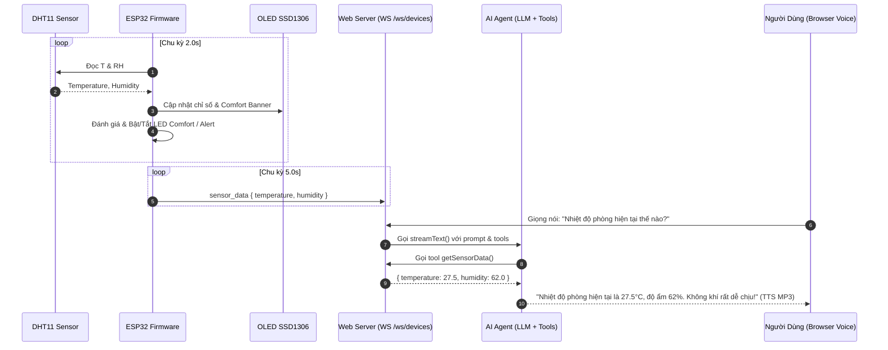

# POC-VA-01: Climate Voice Monitor (DHT11 + OLED SSD1306 + AI Voice Query)

POC đầu tiên trong lộ trình Smart Home Voice Assistant: Giám sát nhiệt độ, độ ẩm phòng thời gian thực, hiển thị trực quan lên màn hình OLED SSD1306, cảnh báo LED vi khí hậu và hỗ trợ hỏi đáp bằng giọng nói tự nhiên thông qua mô hình AI (LLM) và giọng đọc tiếng Việt (edge-tts).

---

## 1. Bảng Ánh Xạ Chân Ngoại Vi (Hardware Pinout Map)

Tuân thủ nghiêm ngặt **Quy chuẩn Xác thực Sơ đồ Chân Ngoại vi (Rule 7, AGENTS.md)**:

| Chân ESP32 DevKit V1 (30 chân) | Ký hiệu in trên Bo Mạch Thực Tế | Chân trên Sơ Đồ Wokwi (`diagram.json`) | Chức Năng Kỹ Thuật & Lưu Ý An Toàn |
|:---:|:---:|:---:|---|
| **GPIO 19** | **`S`** / **`DAT`** | `dht1:SDA` | Chân tín hiệu 1-Wire của module DHT11 (đã có sẵn trở pull-up trên bo mạch) |
| **3V3** | **`+`** / **`VCC`** | `dht1:VCC` | Nguồn 3.3V cấp cho DHT11 và OLED SSD1306 |
| **GND** | **`-`** / **`GND`** | `dht1:GND` | Nối đất chung toàn hệ thống |
| **GPIO 21** | **`SDA`** | `oled1:SDA` | Đường truyền dữ liệu I2C màn hình OLED SSD1306 (địa chỉ mặc định `0x3C`) |
| **GPIO 22** | **`SCL`** | `oled1:SCL` | Đường xung clock I2C màn hình OLED SSD1306 |
| **GPIO 15** | Anode (+) qua trở 220Ω | `r_comfort:1` → `led_comfort:A` | **COMFORT LED (Xanh lá):** Bật sáng khi nhiệt độ 20-28°C và độ ẩm 40-70% |
| **GPIO 13** | Anode (+) qua trở 220Ω | `r_alert:1` → `led_alert:A` | **ALERT LED (Đỏ):** Cảnh báo nhiệt độ cao (≥ 32°C) hoặc nồm ẩm cao (≥ 75%) |
| **GND** | Cathode (-) LED | `led_comfort:C`, `led_alert:C` | Nối đất qua chân GND của ESP32 |

> ⚠️ **Lưu ý an toàn module DHT11:** Không cắm nhầm chân `S` vào `3V3` và `+` vào GPIO. Module 3 chân trong kit thí nghiệm đã tích hợp sẵn điện trở pull-up 10kΩ.

---

## 2. Kiến Trúc Hoạt Động



---

## 3. Quy Trình Kiểm Chứng CLI Tiêu Chuẩn

### Bước 1: Xác thực cú pháp sơ đồ Wokwi
```bash
node -e 'JSON.parse(require("fs").readFileSync("pocs/poc-va-01-climate-voice-monitor/diagram.json", "utf8"))'
```

### Bước 2: Biên dịch Firmware (Dual-Target)
```bash
# 1. Biên dịch cho bo mạch phần cứng thật (DHT11)
pio run -d pocs/poc-va-01-climate-voice-monitor -e esp32dev

# 2. Biên dịch cho môi trường giả lập Wokwi (DHT22)
pio run -d pocs/poc-va-01-climate-voice-monitor -e wokwi
```

### Bước 3: Lint sơ đồ Wokwi bằng CLI
```bash
wokwi-cli lint pocs/poc-va-01-climate-voice-monitor
```

### Bước 4: Kiểm thử tự động trên Wokwi Simulator
```bash
wokwi-cli --expect-text "SENSOR_DATA" --timeout 15000 pocs/poc-va-01-climate-voice-monitor
```

### Bước 5: Nạp code lên Board Thật
```bash
# Tìm cổng USB Serial
pio device list

# Nạp code lên ESP32
pio run -d pocs/poc-va-01-climate-voice-monitor -e esp32dev -t upload --upload-port /dev/cu.usbserial-XXXX

# Theo dõi Serial Monitor 115200 baud
pio device monitor -p /dev/cu.usbserial-XXXX -b 115200
```

---

## 4. Tương Tác Giọng Nói Mẫu

1. **Hỏi nhiệt độ phòng:**
   - *User:* "Nhiệt độ phòng bao nhiêu?" / "How warm is the room?"
   - *AI:* "Nhiệt độ phòng hiện tại là 27.5°C, độ ẩm 62%, không khí rất mát mẻ và dễ chịu."
2. **Hỏi về độ ẩm:**
   - *User:* "Độ ẩm trong nhà thế nào?"
   - *AI:* "Độ ẩm phòng đang ở mức 62%, trong ngưỡng lý tưởng cho sức khỏe."
3. **Cảnh báo khi nhiệt độ cao (≥ 32°C):**
   - *AI chủ động cảnh báo:* "Nhiệt độ phòng đang khá cao, khoảng 33°C. Bạn có muốn bật quạt hoặc điều hòa không?"
