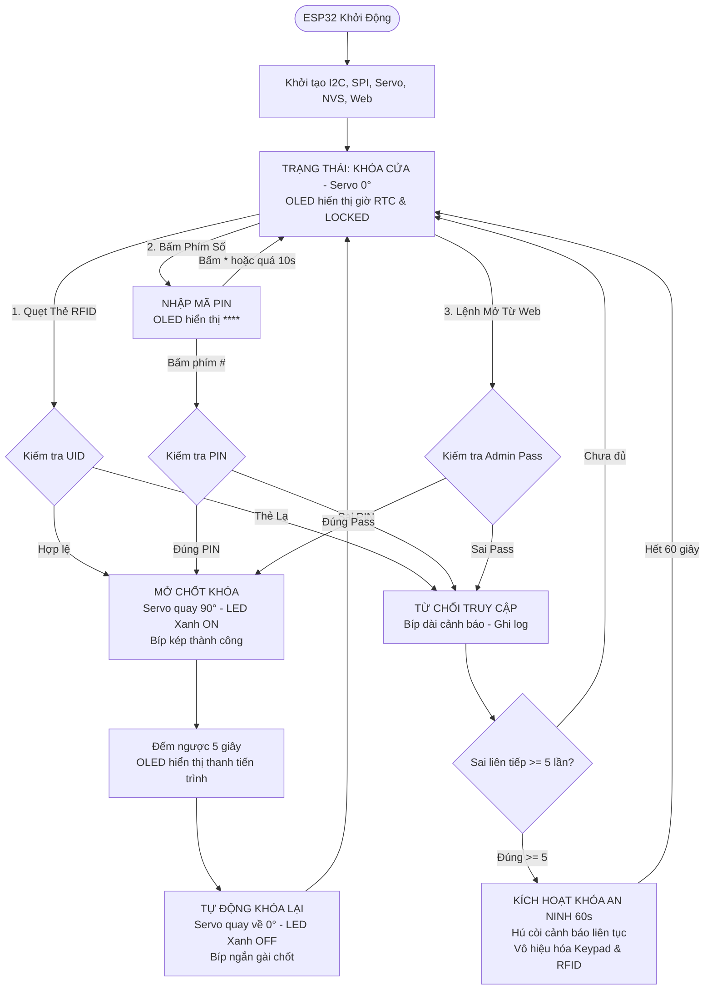

# POC SMH-02: Khóa Cửa Điện Tử Thông Minh 3 Lớp Bảo Mật
## (Tri-Factor Smart Access Lock)

Dự án hiện thực hệ thống kiểm soát cửa phòng / tủ đồ bảo mật cao trên vi điều khiển **ESP32 DevKit V1 (30 chân)**, tích hợp đồng thời 3 nhân tố xác thực độc lập: **Thẻ từ RFID Mifare (Vật lý)**, **Mã PIN Bàn phím ma trận 4x4 (Tri thức)**, và **Giao diện Web Quản trị từ xa (Mạng điều khiển)**.

Hệ thống điều khiển chốt khóa cơ học bằng **Động cơ Servo SG90**, tự động khóa lại sau **5 giây**, phản hồi trực quan qua **Màn hình OLED SSD1306**, ghi nhận thời gian thực qua **RTC DS3231/DS1307**, và bảo vệ chống tấn công dò mã bằng cơ chế **Khóa hệ thống (Lockout) & Còi báo động**.

---

## 1. Tính Năng Kỹ Thuật Nổi Bật

1. **Tam Thức Xác Thực (Tri-Factor Authentication):**
   - **Nhân tố 1 (RFID):** Quẹt thẻ Mifare Classic 1K / Ultralight qua đầu đọc RC522 (VSPI). Hỗ trợ thẻ Master và danh bạ thẻ thành viên lưu trong Flash NVS.
   - **Nhân tố 2 (Keypad 4x4):** Nhập mã PIN bảo mật 4–8 số qua bàn phím ma trận. Hỗ trợ phím `*` để xóa/hủy, phím `#` để gửi xác nhận. Tự động hủy nếu không thao tác sau 10 giây.
   - **Nhân tố 3 (Web Remote):** Mở khóa từ xa qua Web Portal / REST API chạy trực tiếp trên ESP32, bảo vệ bằng mật khẩu quản trị.
2. **Cơ Chế Chốt Khóa Cơ Học (Servo SG90):**
   - Vị trí khóa (LOCKED): $0^\circ$.
   - Vị trí mở (UNLOCKED): $90^\circ$.
   - **Tự động khóa lại (Auto-Relock):** Sau 5 giây đếm ngược, servo tự động kéo chốt về $0^\circ$ và phát còi bíp ngắn xác nhận.
3. **Màn Hình Hiển Thị & Đồng Hồ Thời Gian Thực:**
   - OLED SSD1306 (128×64) hiển thị thời gian thực từ RTC DS3231, trạng thái chốt cửa, thanh đếm ngược tự khóa, và giao diện nhập PIN ẩn (`****`).
   - Mọi sự kiện mở cửa hoặc xâm nhập trái phép đều được ghi nhận vào nhật ký truy cập (Access Log) kèm dấu thời gian chính xác (Timestamp).
4. **Hệ Thống Phản Hồi Âm Thanh & Đèn Chỉ Báo (Non-blocking):**
   - **Active Buzzer:** Bíp ngắn khi bấm phím/quẹt thẻ; Bíp kép khi mở khóa thành công; Bíp dài cảnh báo lỗi; Còi hú dồn dập khi bị khóa an ninh.
   - **Unlock LED:** Bật sáng xanh trong suốt thời gian mở cửa.
5. **Cơ Chế Chống Dò Mã (Brute-Force Protection & Lockout):**
   - Đếm số lần nhập sai liên tiếp (PIN hoặc Thẻ lạ).
   - Nếu sai $\ge 5$ lần: Kích hoạt chế độ **LOCKOUT**, vô hiệu hóa toàn bộ bàn phím và đầu đọc RFID trong **60 giây**, hú còi báo động liên tục và ghi log cảnh báo an ninh.

---

## 2. Sơ Đồ Đấu Nối Phần Cứng (Hardware Pinout Mapping)

> ⚠️ **Quy tắc an toàn điện áp:**
> - Module RFID RC522 **bắt buộc cấp nguồn 3.3V** từ chân `3V3` của ESP32 (Cấm cấp 5V gây cháy chip MFRC522).
> - Động cơ Servo SG90 cấp nguồn 5V từ chân `VIN` (khi cắm USB) và **bắt buộc nối chung Mass (GND)** với ESP32.
> - Cả OLED SSD1306 và RTC DS3231 dùng chung bus I2C (GPIO 21 SDA, GPIO 22 SCL) vì địa chỉ I2C không xung đột (`0x3C` và `0x68`).

| Chân ESP32 DevKit V1 (30 Pin) | Linh kiện ngoại vi | Chân kết nối linh kiện | Chức năng kỹ thuật & An toàn |
| :--- | :--- | :--- | :--- |
| **3V3** | RFID RC522, OLED, RTC | `3.3V` / `VCC` | Cấp nguồn logic 3.3V an toàn. |
| **VIN (5V)** | Động cơ Servo SG90 | Dây Đỏ (`VCC`) | Nguồn 5V nuôi động cơ xoay chốt. |
| **GND** | Toàn bộ linh kiện | `GND` | Nối mass chung toàn mạch. |
| **GPIO 23** | RFID RC522 | `MOSI` | SPI Master Out Slave In (VSPI). |
| **GPIO 19** | RFID RC522 | `MISO` | SPI Master In Slave Out (kéo pullup). |
| **GPIO 18** | RFID RC522 | `SCK` | SPI Clock. |
| **GPIO 5** | RFID RC522 | `SDA (SS)` | SPI Chip Select (CS). |
| **GPIO 4** | RFID RC522 | `RST` | Reset phần cứng module RC522. |
| **GPIO 21** | OLED SSD1306 & RTC DS3231 | `SDA` | Đường truyền dữ liệu I2C dùng chung. |
| **GPIO 22** | OLED SSD1306 & RTC DS3231 | `SCL` | Đường xung nhịp I2C dùng chung. |
| **GPIO 13** | Động cơ Servo SG90 | Dây Cam/Vàng (`PWM`) | Xung 50Hz điều khiển góc $0^\circ \leftrightarrow 90^\circ$. |
| **GPIO 15** | Active Buzzer | Chân Dương (`+`) | Phát tín hiệu âm thanh (Chân âm nối GND). |
| **GPIO 2** | LED Xanh (Unlock) | Anode (`+`) qua trở 220Ω | Báo mở khóa (Cathode nối GND, trùng onboard LED). |
| **GPIO 14** | Keypad 4x4 | Chân `R1` (Hàng 1) | Quét phím: `1`, `2`, `3`, `A` (Output). |
| **GPIO 27** | Keypad 4x4 | Chân `R2` (Hàng 2) | Quét phím: `4`, `5`, `6`, `B` (Output). |
| **GPIO 16** | Keypad 4x4 | Chân `R3` (Hàng 3) | Quét phím: `7`, `8`, `9`, `C` (Output). |
| **GPIO 17** | Keypad 4x4 | Chân `R4` (Hàng 4) | Quét phím: `*`, `0`, `#`, `D` (Output). |
| **GPIO 26** | Keypad 4x4 | Chân `C1` (Cột 1) | Đọc phím cột 1 (`INPUT_PULLUP`). |
| **GPIO 25** | Keypad 4x4 | Chân `C2` (Cột 2) | Đọc phím cột 2 (`INPUT_PULLUP`). |
| **GPIO 33** | Keypad 4x4 | Chân `C3` (Cột 3) | Đọc phím cột 3 (`INPUT_PULLUP`). |
| **GPIO 32** | Keypad 4x4 | Chân `C4` (Cột 4) | Đọc phím cột 4 (`INPUT_PULLUP`). |

---

## 3. Quy Trình Vận Hành 3 Lớp



---

## 4. Giao Diện Web Quản Trị & REST APIs

Khi ESP32 khởi động, thiết bị tự động kết nối Wi-Fi cấu hình và đồng thời phát mạng SoftAP riêng:
- **Tên Wi-Fi phát ra (AP):** `SMH02-SmartLock-AP`
- **Mật khẩu AP:** `12345678`
- **Địa chỉ truy cập Web:** `http://192.168.4.1` (hoặc IP cấp bởi router Wi-Fi nhà).

### REST API Endpoints:
- `GET /api/status`: Lấy trạng thái khóa hiện tại, thời gian RTC, trạng thái Lockout.
- `POST /api/unlock`: Mở khóa cửa từ xa. Payload: `{"password": "admin123"}`.
- `GET /api/logs`: Xem lịch sử ra vào gần nhất kèm timestamp.
- `GET /api/cards`: Xem danh sách thẻ RFID được cấp quyền.
- `POST /api/cards/add`: Thêm thẻ mới. Payload: `{"password": "...", "uid": "A1B2C3D4"}`.
- `POST /api/cards/remove`: Xóa thẻ. Payload: `{"password": "...", "uid": "A1B2C3D4"}`.
- `POST /api/pin`: Đổi mã PIN mở cửa. Payload: `{"password": "...", "new_pin": "5678"}`.

---

## 5. Lệnh Biên Dịch & Nạp Firmware

```bash
# 1. Biên dịch firmware cho board thật
~/.platformio/penv/bin/pio run -d pocs/smh-02-trifactor-smart-lock -e esp32dev

# 2. Biên dịch firmware cho môi trường mô phỏng Wokwi
~/.platformio/penv/bin/pio run -d pocs/smh-02-trifactor-smart-lock -e wokwi

# 3. Nạp firmware lên ESP32 thật qua cổng USB (thay cổng tương ứng)
~/.platformio/penv/bin/pio run -d pocs/smh-02-trifactor-smart-lock -e esp32dev -t upload --upload-port /dev/cu.usbserial-0001

# 4. Mở Serial Monitor theo dõi log hoạt động (115200 baud)
~/.platformio/penv/bin/pio device monitor -p /dev/cu.usbserial-0001 -b 115200
```
