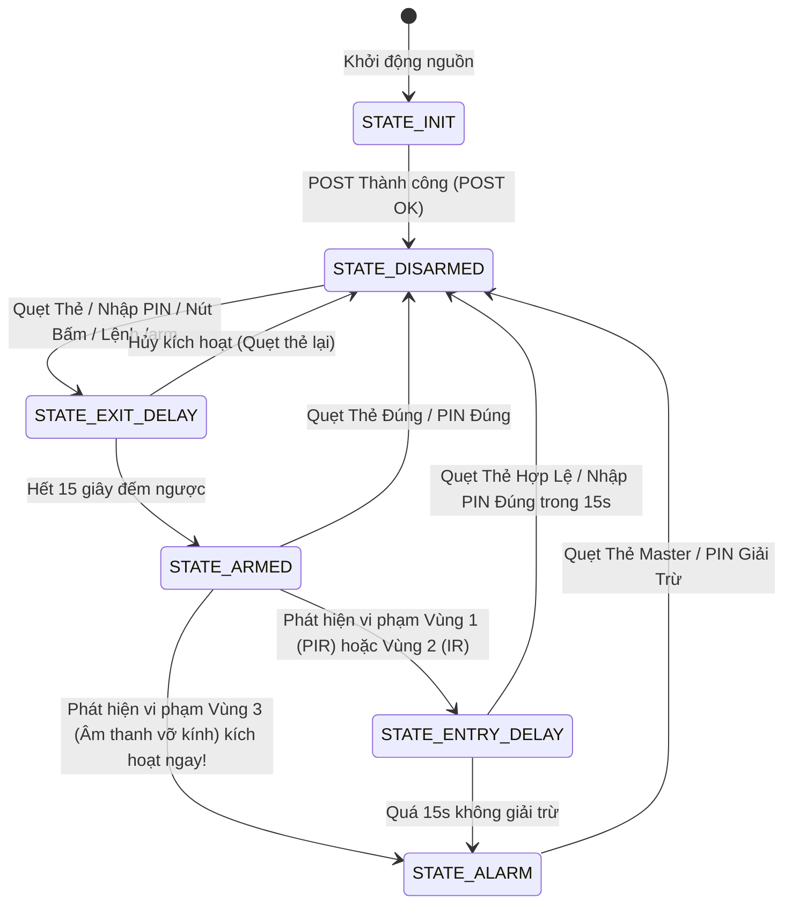

# Kế Hoạch Triển Khai & Báo Cáo Nghiên Cứu POC SMH-01: Hệ Thống An Ninh Giám Sát Đa Vùng Cảnh Báo Tức Thời (Multi-Zone Defense System)

> **Mã Đề Tài:** SMH-01  
> **Nhánh Git chỉ định:** `wt/poc/smh-01-multizone-defense-system`  
> **Thư mục triển khai:** `pocs/poc-smh-01-multizone-defense-system`  
> **Vi điều khiển mục tiêu:** ESP32 DevKit V1 (30 chân)  
> **Môi trường & Công cụ:** PlatformIO Core CLI (`pio`) + Wokwi CLI (`wokwi-cli`) + Arduino Framework  

---

## 1. Tổng Quan & Yêu Cầu Đề Tài (Requirements Analysis)

### 1.1 Mục Tiêu Thực Tiễn
Hệ thống an ninh giám sát đa vùng (Multi-Zone Defense System) là giải pháp bảo vệ toàn diện ngôi nhà bằng cách phân chia không gian thành **3 vùng giám sát vật lý độc lập**, kết hợp cơ chế kiểm soát truy cập xác thực kép (RFID + PIN) và hệ thống phản xạ báo động đa tầng (Còi hú, Đèn pha công suất lớn qua Relay, Màn hình OLED, Đồng hồ thời gian thực RTC, và Tin nhắn cảnh báo tức thời qua Telegram Bot).

### 1.2 Yêu Cầu Chức Năng Cốt Lõi (Functional Requirements)
1. **Giám sát 3 vùng an ninh độc lập (3 Independent Security Zones):**
   - **Vùng 1 (Hành lang / Không gian trong nhà):** Cảm biến chuyển động hồng ngoại thụ động **PIR HC-SR501** (phát hiện thân nhiệt di chuyển).
   - **Vùng 2 (Cửa sổ / Ban công / Hàng rào chu vi):** Module cảm biến hồng ngoại **LM393 IR Sensor / IR Beam** (phát hiện cắt tia hoặc vượt rào cản).
   - **Vùng 3 (Phòng khách / Khu vực cửa chính):** Module cảm biến âm thanh **Sound Sensor HW-484** (lọc ngưỡng biên độ phát hiện tiếng cậy phá cửa, đập vỡ kính).
2. **Cơ chế Bật / Tắt Bảo Vệ (Arm / Disarm Subsystem):**
   - **Xác thực qua Thẻ Từ RFID RC522 (13.56MHz):**
     - Hỗ trợ quẹt thẻ Master để Arm/Disarm hệ thống tức thời.
     - Cho phép lưu trữ danh sách thẻ hợp lệ (Whitelisted UIDs) vào bộ nhớ NVS Flash không bay hơi.
   - **Xác thực qua Mã PIN (Bàn phím ma trận 4x4 & Serial Console CLI):**
     - Nhập mã PIN cá nhân (mặc định: `1234#`) trên Keypad hoặc giao diện dòng lệnh Serial Terminal để đổi trạng thái.
   - **Thời gian trễ an toàn (Delays):**
     - **Exit Delay (15 giây):** Sau khi kích hoạt bảo vệ (ARM), gia chủ có 15s để rời khỏi nhà trước khi các cảm biến chuyển sang chế độ kích nổ báo động.
     - **Entry Delay (15 giây):** Khi mở cửa vào nhà ở chế độ ARMED, hệ thống bíp cảnh báo nhịp nhanh trong 15s để gia chủ kịp quẹt thẻ / bấm PIN giải trừ (DISARM) trước khi hú còi toàn diện.
3. **Cơ cấu Phản ứng Báo động Đa Tầng (Multi-Tier Defense Actuation):**
   - **Tầng 1 - Cảnh báo hiển thị & âm lượng thấp:** Đèn LED Đỏ chớp nháy Strobe tần số cao; Màn hình OLED SSD1306 hiển thị cảnh báo `[ALERT] VÙNG X BỊ XÂM NHẬP!`.
   - **Tầng 2 - Còi hú xua đuổi (Buzzer):** Kích hoạt còi Piezo Buzzer phát chuỗi âm thanh tần số quét đa điệu (Police Siren Sweep 1500Hz - 3000Hz).
   - **Tầng 3 - Cơ cấu công suất lớn (Relay 2 kênh 5V):**
     - **Relay 1 (Kênh Đèn pha chiếu sáng):** Đóng tiếp điểm kích hoạt đèn Floodlight chiếu rọi vị trí đột nhập.
     - **Relay 2 (Kênh Còi hú ngoài trời):** Đóng tiếp điểm kích hoạt còi công suất lớn (12V/220V ngoài trời).
4. **Nhật Ký Sự Kiện Thời Gian Thực (Audit Trail & Logging):**
   - Sử dụng đồng hồ thời gian thực **RTC DS3231 / DS1307** lấy timestamp chính xác từng giây (YYYY-MM-DD hh:mm:ss).
   - Lưu trữ 10 sự kiện xâm nhập gần nhất vào bộ nhớ NVS Flash kèm mã vùng bị vi phạm và phương thức Arm/Disarm.
   - Hiển thị bảng nhật ký trên màn hình OLED và xuất log chi tiết qua Serial Monitor.
5. **Cảnh Báo Từ Xa Qua Mạng (Wi-Fi & Telegram Bot Integration):**
   - Kết nối Wi-Fi ngầm không chặn (Non-blocking background loop). Khi mất mạng, hệ thống vẫn duy trì 100% khả năng báo động nội bộ tại chỗ.
   - Đẩy tin nhắn báo động tức thời tới điện thoại gia chủ qua **Telegram Bot API**:
     - Định dạng: `🚨 [CẢNH BÁO AN NINH SMH-01] Vùng 2 (Cửa sổ) bị xâm nhập lúc 22:30:15! Đèn pha & Còi đã bật.`
   - Nhận lệnh điều khiển từ xa từ gia chủ: `/status`, `/arm`, `/disarm <PIN>`, `/logs`.

---

## 2. Nghiên Cứu Phần Cứng & Sơ Đồ Chân (Hardware Research & Pinout Engineering)

### 2.1 Đặc Tính Vật Lý ESP32 DevKit V1 (30 Chân) & Ràng Buộc Kỹ Thuật
Vi điều khiển có 30 chân vật lý với các đặc thù khắt khe cần tuân thủ theo `docs/hardware/BOARD-ESP32-DEVKIT-V1-30PIN.md` và `AGENTS.md`:
1. **Các chân Input-Only (GPIO 34, 35, 36, 39):**
   - Không hỗ trợ trở kéo nội bộ (`INPUT_PULLUP` không hoạt động).
   - Không thể xuất tín hiệu Output.
   - **Giải pháp tối ưu hóa:** Sử dụng chính 3 chân này cho 3 cảm biến an ninh:
     - **GPIO 34:** PIR HC-SR501 (Tín hiệu 3.3V active HIGH, push-pull).
     - **GPIO 35:** LM393 IR Obstacle (Tín hiệu active LOW, có sẵn trở kéo 10k trên module).
     - **GPIO 39 (VN):** Sound Sensor HW-484 (Tín hiệu active LOW, có sẵn trở kéo trên module).
     *-> Giải phóng 100% các chân GPIO đa năng cho các ngoại vi giao tiếp hai chiều!*
2. **Strapping Pins nguy hiểm (GPIO 0, 2, 12, 15):**
   - **GPIO 12 (MTDI):** CẤM để mức HIGH khi khởi động (nếu kéo lên HIGH sẽ kích hoạt flash 1.8V gây treo bootloader).
   - **GPIO 0:** Cần ở mức HIGH khi boot (kéo xuống LOW sẽ vào chế độ nạp firmware).
   - **GPIO 2:** Nối với LED xanh tích hợp trên board, an toàn làm Output báo trạng thái.
   - **GPIO 15:** Xuất debug ROM khi boot, có thể an toàn làm Output cho LED Xanh Disarm.
3. **Chia sẻ Bus I2C (I2C Shared Bus - 2 chân):**
   - **GPIO 21 (SDA)** và **GPIO 22 (SCL)** dùng chung đồng thời cho:
     - Màn hình OLED SSD1306 (Địa chỉ I2C: `0x3C`).
     - Đồng hồ thời gian thực RTC DS3231/DS1307 (Địa chỉ I2C: `0x68`).
4. **Bus SPI phần cứng (VSPI - 5 chân) cho RFID RC522:**
   - **GPIO 18:** SCK (Clock).
   - **GPIO 19:** MISO (Master In Slave Out).
   - **GPIO 23:** MOSI (Master Out Slave In).
   - **GPIO 5:** SDA / SS (Chip Select).
   - **GPIO 4:** RST (Reset module RC522).
   - *Cảnh báo nguồn điện:* Module RC522 **bắt buộc cấp nguồn 3.3V từ chân 3V3** (tuyệt đối không nối 5V sẽ làm nổ IC MFRC522).
5. **Cơ cấu Chấp hành & Cảnh báo (Actuators - 3 chân):**
   - **GPIO 25:** Piezo Buzzer (Hỗ trợ phát âm tần tone / xung PWM).
   - **GPIO 26:** Relay Kênh 1 (Kích hoạt Đèn pha).
   - **GPIO 27:** Relay Kênh 2 (Kích hoạt Còi hú ngoài trời).
6. **Bàn phím ma trận 4x4 (Keypad Matrix 4x4) & Phương án Phân bổ Linh hoạt:**
   - Bàn phím 4x4 tiêu chuẩn cần 8 đường tín hiệu (4 Hàng x 4 Cột).
   - Để tránh xung đột với các Strapping Pin (GPIO 12, GPIO 0), hệ thống thiết kế cơ chế **Kiến Trúc Hai Lớp (Dual Input Architecture)**:
     - **Lớp 1 (Mặc định trong kho & Wokwi):** Xác thực chính bằng **Thẻ Từ RFID RC522** + Điều khiển/Nhập mã qua **Serial CLI Console & Telegram Bot**.
     - **Lớp 2 (Mở rộng Phần cứng Keypad):** Hỗ trợ cấu hình bật cờ `-DENABLE_KEYPAD` trong `platformio.ini`, sử dụng các chân GPIO an toàn: Hàng (GPIO 13, 14, 16, 17), Cột (GPIO 32, 33, 15, 2) với giải thuật quét chủ động chống treo boot.

### 2.2 Bảng Ánh Xạ Chân Toàn Diện (Pinout Map)

| Chân ESP32 | Linh Kiện | Chân Module | Giao Thức / Chế Độ | Chức Năng Kỹ Thuật & An Toàn |
| :--- | :--- | :--- | :--- | :--- |
| **VIN (5V)** | PIR HC-SR501 | `VCC` | Power (5V) | Cấp nguồn 5V USB (IC BISS0001 cần $\ge 4.5\text{V}$) |
| **GND** | PIR, IR, Sound, OLED, Relay, Buzzer | `GND` | Ground | Điểm mass chung toàn hệ thống |
| **3V3 (3.3V)**| RC522, OLED, RTC, IR, Sound | `VCC / 3.3V` | Power (3.3V) | Cấp nguồn logic an toàn 3.3V |
| **GPIO 34** | Cảm biến PIR HC-SR501 | `OUT` | Input (Zone 1) | Ngõ vào số 3.3V TTL phát hiện chuyển động |
| **GPIO 35** | Cảm biến vật cản IR LM393 | `OUT / DO` | Input (Zone 2) | Active LOW khi bị che tia / phát hiện đột nhập |
| **GPIO 39** | Cảm biến âm thanh HW-484 | `DO` | Input (Zone 3) | Active LOW khi phát hiện tiếng động lớn / cậy cửa |
| **GPIO 21** | OLED SSD1306 & RTC DS3231 | `SDA` | I2C Data | Chia sẻ bus I2C (địa chỉ 0x3C & 0x68) |
| **GPIO 22** | OLED SSD1306 & RTC DS3231 | `SCL` | I2C Clock | Xung nhịp I2C chuẩn 400kHz |
| **GPIO 18** | RFID RC522 | `SCK` | SPI Clock | Bus VSPI phần cứng |
| **GPIO 19** | RFID RC522 | `MISO`| SPI MISO | Dữ liệu từ thẻ từ về vi điều khiển |
| **GPIO 23** | RFID RC522 | `MOSI`| SPI MOSI | Dữ liệu từ vi điều khiển sang RC522 |
| **GPIO 5** | RFID RC522 | `SDA (CS)` | SPI Chip Select | Kích chọn module RFID khi truyền nhận |
| **GPIO 4** | RFID RC522 | `RST` | Digital Output | Reset phần cứng module RC522 |
| **GPIO 25** | Còi Buzzer | `(+)` | Output (PWM/Tone) | Còi phát tín hiệu âm thanh đa tần số |
| **GPIO 26** | Module Relay 2CH | `IN1` | Digital Output | Kích Relay 1 bật Đèn pha chiếu rọi |
| **GPIO 27** | Module Relay 2CH | `IN2` | Digital Output | Kích Relay 2 bật Còi hú ngoài trời |
| **GPIO 2** | LED Báo Động (Đỏ) | `Anode (+)` | Output (220Ω) | Đèn LED nhấp nháy Strobe khi báo động / ARMED |
| **GPIO 15** | LED An Toàn (Xanh) | `Anode (+)` | Output (220Ω) | Đèn LED sáng khi hệ thống DISARMED |
| **GPIO 13** | Nút Bấm Khẩn Cấp / Arm Toggle| Chân nút bấm | INPUT_PULLUP | Nút bấm thao tác nhanh chuyển chế độ tại chỗ |

---

## 3. Kiến Trúc Phần Mềm & Thiết Kế Máy Trạng Thái (Software Architecture & FSM)

### 3.1 Máy Trạng Thái Hữu Hạn (Finite State Machine - FSM)



### 3.2 Đặc Tả Từng Trạng Thái
1. **`STATE_INIT` (Khởi tạo hệ thống):**
   - Khởi tạo cổng Serial (115200 baud).
   - Kiểm tra kết nối I2C (OLED SSD1306, RTC DS3231).
   - Khởi tạo SPI và kiểm tra firmware version của RFID RC522 (`0x12` hoặc `0x18` hoặc `0x92`).
   - Nạp danh sách thẻ hợp lệ và cấu hình PIN từ NVS Flash.
   - Chạy kiểm tra Power-on Self Test (POST): Bíp 2 tiếng ngắn, chớp LED xác nhận phần cứng lành lặn.
   - Tự động chuyển sang `STATE_DISARMED`.
2. **`STATE_DISARMED` (Hệ thống an toàn):**
   - LED Xanh sáng tĩnh; LED Đỏ tắt; Relays ngắt hoàn toàn.
   - Màn hình OLED hiển thị: Ngày giờ RTC, nhiệt độ phòng, trạng thái 3 vùng (`Zone 1: OK`, `Zone 2: OK`, `Zone 3: OK`).
   - Các cảm biến vẫn được đọc để cập nhật tình trạng vùng nhưng không kích hoạt báo động.
3. **`STATE_EXIT_DELAY` (Đếm ngược rời nhà):**
   - Đếm ngược từ 15 giây về 0 giây.
   - Buzzer phát tiếng bíp ngắn mỗi 1 giây (`tone(25, 2000, 50)`).
   - OLED hiển thị đồng hồ đếm ngược to bản: `EXIT DELAY: 15s...`
   - Cho phép gia chủ quẹt thẻ để hủy nếu quên đồ.
4. **`STATE_ARMED` (Chế độ tuần tra bảo vệ):**
   - LED Đỏ sáng; LED Xanh tắt; Còi tắt; Relays ngắt sẵn sàng.
   - OLED hiển thị: `[SYSTEM ARMED] MONITORING 3 ZONES`.
   - Giám sát ngắt và quét liên tục 3 vùng an ninh.
5. **`STATE_ENTRY_DELAY` (Đếm ngược vào nhà):**
   - Khi có chuyển động mở cửa, hệ thống không hú còi ngay mà đếm ngược 15 giây.
   - Buzzer bíp nhịp nhanh dồn dập (3 bíp/giây) để nhắc nhở người vào nhà quẹt thẻ hoặc bấm PIN.
   - Nếu nhập đúng: Chuyển về `STATE_DISARMED`.
   - Nếu sau 15 giây không có thao tác hợp lệ: Lập tức kích nổ `STATE_ALARM`.
6. **`STATE_ALARM` (Báo động khẩn cấp):**
   - Còi Buzzer phát âm thanh Police Siren (tần số quét tuần hoàn).
   - Relay 1 đóng: Đèn pha rọi sáng.
   - Relay 2 đóng: Còi công suất ngoài trời hú vang.
   - LED Đỏ chớp nháy Strobe liên tục nhịp 100ms.
   - RTC ghi nhận thời điểm chính xác của vi phạm và ghi vào NVS Log Buffer.
   - Đẩy tin nhắn khẩn cấp qua Telegram Bot API (nếu có Wi-Fi).
   - Chỉ giải trừ được bằng Thẻ RFID hợp lệ hoặc mã PIN đúng.

### 3.3 Cấu Trúc Mã Nguồn (Modular Source Tree)
```text
pocs/poc-smh-01-multizone-defense-system/
├── platformio.ini               # Cấu hình PlatformIO dual target ([env:esp32dev], [env:wokwi])
├── wokwi.toml                   # Cấu hình nạp firmware ELF cho Wokwi CLI
├── diagram.json                 # Sơ đồ mạch trực quan Wokwi với đầy đủ labels
├── README.md                    # Tài liệu hướng dẫn sử dụng, bảng nối dây & lệnh CLI
└── src/
    ├── config.h                 # Định nghĩa chân GPIO, hằng số thời gian, cấu hình hệ thống
    ├── types.h                  # Các kiểu dữ liệu enum trạng thái, cấu trúc log
    ├── sensor_manager.h/.cpp    # Xử lý lọc nhiễu, debounce, đọc ngắt 3 vùng cảm biến
    ├── auth_manager.h/.cpp      # Xử lý thẻ từ RFID RC522, danh sách thẻ NVS, mã PIN
    ├── actuator_manager.h/.cpp  # Điều khiển Buzzer không chặn, Relays, LED Strobe
    ├── display_manager.h/.cpp   # Quản lý giao diện màn hình OLED SSD1306 đa trang
    ├── rtc_manager.h/.cpp       # Đọc giờ DS3231/DS1307, lưu trữ & truy xuất log vi phạm NVS
    ├── network_manager.h/.cpp   # Kết nối Wi-Fi ngầm & gửi/nhận lệnh Telegram Bot
    └── main.cpp                 # Điểm khởi chạy, vòng lặp chính & bộ điều phối FSM
```

---

## 4. Kế Hoạch Triển Khai Chi Tiết Từng Bước (Step-by-Step Implementation Tasks)

### Milestone 1: Khởi Tạo Dự Án & Cấu Hình Môi Trường Kép (Dual-Target Setup)
- [ ] **Task 1.1:** Khởi tạo thư mục dự án `pocs/poc-smh-01-multizone-defense-system`.
- [ ] **Task 1.2:** Tạo `platformio.ini` với hai môi trường rõ ràng:
  - `[env:esp32dev]`: Tối ưu hóa cho bo mạch thật, tích hợp thư viện `MFRC522`, `Adafruit SSD1306`, `RTClib`, `WiFi`, `HTTPClient`.
  - `[env:wokwi]`: Tích hợp cờ định danh `-DWOKWI_SIMULATION`.
- [ ] **Task 1.3:** Tạo `wokwi.toml` liên kết file firmware `.pio/build/wokwi/firmware.elf` và sơ đồ `diagram.json`.

### Milestone 2: Thiết Kế Sơ Đồ Mạch Wokwi Chuẩn Nhãn Trực Quan (`diagram.json`)
- [ ] **Task 2.1:** Khởi tạo `diagram.json` kết nối đầy đủ các linh kiện:
  - `board-esp32-devkit-v1`
  - `board-mfrc522` (với label và UID mẫu `DE:AD:BE:EF`)
  - `wokwi-pir-motion-sensor` (Zone 1 - PIR, nối GPIO 34)
  - `wokwi-pushbutton` (Zone 2 - Cửa sổ IR Beam Sim, nối GPIO 35)
  - `wokwi-pushbutton` (Zone 3 - Kính vỡ / Âm thanh Sim, nối GPIO 39)
  - `wokwi-ssd1306` (OLED I2C, nối GPIO 21 & 22)
  - `wokwi-ds1307` (RTC Clock I2C, nối GPIO 21 & 22)
  - `wokwi-relay-module` (Relay 2 kênh, nối GPIO 26 & 27)
  - `wokwi-buzzer` (Piezo Siren, nối GPIO 25)
  - `wokwi-led` đỏ + xanh kèm trở 220Ω (nối GPIO 2 và GPIO 15)
  - `wokwi-pushbutton` (Nút bấm thao tác Arm/Disarm tại chỗ, nối GPIO 13)
- [ ] **Task 2.2:** Gán đầy đủ thuộc tính `"label"` cho 100% linh kiện theo quy chuẩn `AGENTS.md`.
- [ ] **Task 2.3:** Kiểm tra cú pháp JSON và lint bằng `wokwi-cli lint`.

### Milestone 3: Xây Dựng Các Module Cốt Lõi Phần Cứng (Core Hardware Drivers)
- [ ] **Task 3.1 (`config.h` & `types.h`):** Khai báo các hằng số chân, nhịp delay, enum `SystemState`, enum `SecurityZone`, cấu trúc `SecurityEventLog`.
- [ ] **Task 3.2 (`sensor_manager`):** Lập trình module đọc và lọc nhiễu cho 3 vùng cảm biến (PIR, IR, Sound) sử dụng kỹ thuật Non-blocking Timer và cơ chế phát hiện xung cạnh xuống/lên an toàn.
- [ ] **Task 3.3 (`actuator_manager`):** Lập trình bộ điều khiển Buzzer (còi bíp nhịp delay / còi hú đa tần số Siren), Relay 1 (Đèn pha), Relay 2 (Còi công suất), và LED Strobe không dùng hàm `delay()`.
- [ ] **Task 3.4 (`rtc_manager`):** Lập trình driver giao tiếp RTC DS3231/DS1307, định dạng chuỗi ngày giờ, và hệ thống lưu trữ/truy xuất ring-buffer 10 log vi phạm vào bộ nhớ NVS Flash (`Preferences.h`).
- [ ] **Task 3.5 (`display_manager`):** Lập trình giao diện OLED SSD1306 đa trang: Màn hình Dashboard tuần tra, màn hình Countdown Trễ, màn hình Cảnh báo Báo động Khẩn, và màn hình Danh mục Nhật ký (Log viewer).
- [ ] **Task 3.6 (`auth_manager`):** Lập trình driver đọc thẻ từ RFID RC522 (so khớp UID, kiểm tra thẻ Master, quản lý whitelist trong NVS) và giải thuật so khớp mã PIN từ Serial / Keypad.

### Milestone 4: Tích Hợp FSM Toàn Diện & Kênh Điều Khiển Serial CLI (`main.cpp`)
- [ ] **Task 4.1:** Hiện thực hóa toàn bộ luồng chuyển trạng thái máy FSM: `INIT` $\rightarrow$ `DISARMED` $\leftrightarrow$ `EXIT_DELAY` $\rightarrow$ `ARMED` $\rightarrow$ `ENTRY_DELAY` $\rightarrow$ `ALARM`.
- [ ] **Task 4.2:** Tích hợp giao diện điều khiển dòng lệnh Serial CLI tương tác trực tiếp (hỗ trợ kiểm thử trên VS Code Serial Monitor và Wokwi):
  - Phím `a`: Arm hệ thống.
  - Phím `d`: Disarm hệ thống (yêu cầu mã PIN).
  - Phím `1`, `2`, `3`: Kích hoạt giả lập vi phạm Vùng 1, Vùng 2, Vùng 3.
  - Phím `l`: Xem danh sách nhật ký vi phạm thời gian thực từ RTC & NVS.
  - Phím `?`: Hiển thị menu trợ giúp lệnh CLI.
- [ ] **Task 4.3:** Tích hợp module kết nối Wi-Fi & Telegram Bot notification với kiến trúc Non-blocking, bảo đảm cách ly sự cố mạng không ảnh hưởng phản xạ báo động.

### Milestone 5: Biên Dịch, Kiểm Chứng Wokwi CLI & Viết Tài Liệu Kỹ Thuật
- [ ] **Task 5.1:** Biên dịch kiểm tra tĩnh: `pio run -d pocs/poc-smh-01-multizone-defense-system -e esp32dev` và `pio run -d pocs/poc-smh-01-multizone-defense-system -e wokwi`.
- [ ] **Task 5.2:** Kiểm tra sự tồn tại của Binary Artifacts (`firmware.bin` và `firmware.elf`).
- [ ] **Task 5.3:** Kiểm thử tự động trên Wokwi CLI: `wokwi-cli --expect-text "[SMH-01] SYSTEM READY" --timeout 15000 pocs/poc-smh-01-multizone-defense-system`.
- [ ] **Task 5.4:** Soạn thảo `README.md` hoàn chỉnh cho POC gồm: Sơ đồ đấu nối đối chiếu 1-1, bảng ánh xạ chân, hướng dẫn nạp bo thật, hướng dẫn mô phỏng Wokwi, và checklist kiểm thử thực tế.

---

## 5. Cổng Kiểm Chứng Bắt Buộc (Verification Gates)

Mọi mã nguồn và cấu hình của POC SMH-01 phải vượt qua nghiêm ngặt 5 cổng kiểm chứng:
1. **Gate 1 - Cú pháp Sơ đồ:**
   ```bash
   node -e 'JSON.parse(require("fs").readFileSync("pocs/poc-smh-01-multizone-defense-system/diagram.json", "utf8"))'
   wokwi-cli lint pocs/poc-smh-01-multizone-defense-system
   ```
2. **Gate 2 - Biên dịch Firmware Không Cảnh Báo:**
   ```bash
   pio run -d pocs/poc-smh-01-multizone-defense-system -e esp32dev
   pio run -d pocs/poc-smh-01-multizone-defense-system -e wokwi
   ```
3. **Gate 3 - Tính Toàn Vẹn Của Binary Artifacts:**
   ```bash
   test -f pocs/poc-smh-01-multizone-defense-system/.pio/build/esp32dev/firmware.bin && echo "ESP32DEV BIN OK"
   test -f pocs/poc-smh-01-multizone-defense-system/.pio/build/wokwi/firmware.bin && echo "WOKWI BIN OK"
   ```
4. **Gate 4 - Xác Thực Hành Vi Tự Động Trên Wokwi Simulator:**
   ```bash
   wokwi-cli --expect-text "SMH-01" --timeout 15000 pocs/poc-smh-01-multizone-defense-system
   ```
5. **Gate 5 - Sẵn Sàng Cho Board Thật (Hardware Verification Ready):**
   - Đầy đủ thông số baudrate 115200, lệnh upload và lệnh monitor trực tiếp qua cổng `/dev/cu.usbserial-XXXX`.
