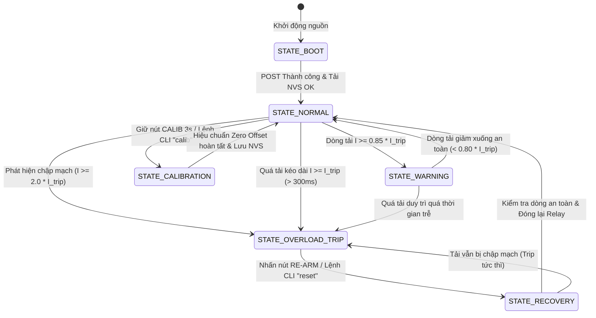
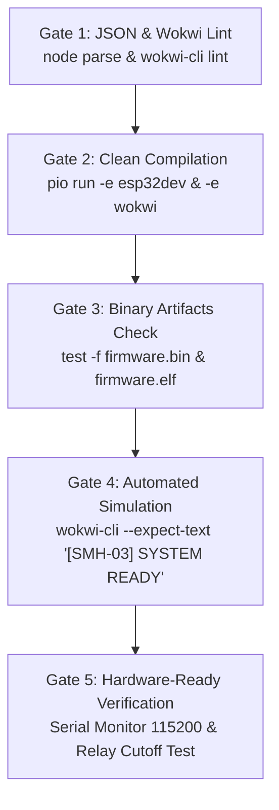

# Kế Hoạch Triển Khai & Báo Cáo Nghiên Cứu POC SMH-03: Thiết Bị Đo Điện Năng & Tự Ngắt Bảo Vệ Quá Tải (Smart Energy Meter)

> **Mã Đề Tài:** SMH-03  
> **Tên Đề Tài:** Thiết Bị Đo Điện Năng & Tự Ngắt Bảo Vệ Quá Tải (Smart Energy Meter & Overload Circuit Breaker)  
> **Nhánh Git chỉ định:** `wt/poc/smh-03-smart-energy-meter`  
> **Thư mục triển khai:** `pocs/poc-smh-03-smart-energy-meter`  
> **Vi điều khiển mục tiêu:** ESP32 DevKit V1 (30 chân)  
> **Nền tảng & Công cụ:** PlatformIO Core CLI (`pio`) + Wokwi CLI (`wokwi-cli`) + Arduino Framework  

---

## 1. Tổng Quan & Yêu Cầu Đề Tài (Requirements Analysis)

### 1.1 Mục Tiêu Thực Tiễn
Trong các hệ thống quản lý điện năng gia đình (Home Energy Management) và tự động hóa nhà thông minh (Smart Home), việc theo dõi lượng điện năng tiêu thụ tức thời cũng như phát hiện sớm sự cố quá tải, chập chạm là nhu cầu thiết yếu.
POC **SMH-03 (Smart Energy Meter)** được phát triển nhằm mục tiêu:
1. **Đo lường thời gian thực:** Giám sát liên tục cường độ dòng điện ($I_{\text{DC}}$ / $I_{\text{RMS}}$), điện áp tải ($V$), tính toán công suất tiêu thụ tức thời ($P = V \times I$), năng lượng tích lũy ($E$ tính bằng Wh / kWh) và ước tính tiền điện theo bậc giá.
2. **Tự động ngắt bảo vệ quá tải (Active Overcurrent Protection - OCP):** Tự động ngắt tiếp điểm Relay khi dòng điện vượt ngưỡng cài đặt (ví dụ: > 2.0A hoặc giá trị tùy chỉnh) nhằm bảo vệ phụ tải và dây dẫn khỏi nguy cơ phát nhiệt, chập cháy.
3. **Cơ chế khóa an toàn (Latched Safety Cutoff):** Khi ngắt quá tải, hệ thống khóa cứng trạng thái ngắt và chỉ cho phép đóng tải trở lại khi người dùng xác nhận an toàn qua nút bấm cứng **RESET / RE-ARM** hoặc lệnh từ **Serial CLI**.
4. **Hiển thị trực quan & Cảnh báo đa kênh:** Xuất thông số lên màn hình **LCD 1602 (kèm ba lô I2C PCF8574)**, phát cảnh báo còi **Buzzer** (bíp cảnh báo khi dòng tiệm cận ngưỡng và hú liên tục khi ngắt tải), đèn LED chỉ thị trạng thái và kênh tương tác **Serial CLI Monitor**.

---

### 1.2 Yêu Cầu Chức Năng Cốt Lõi (Functional Requirements)

1. **FR-1: Đo Dòng Điện Độ Phân Giải Cao Qua Cảm Biến Hiệu Ứng Hall ACS712:**
   - Đọc điện áp Analog từ ngõ ra chân `OUT` của module ACS712 qua cầu phân áp $\frac{2}{3}$ kết nối vào kênh **ADC1 GPIO 32** của ESP32.
   - Hỗ trợ các phân loại độ nhạy: ACS712-05B ($185\text{ mV/A}$), ACS712-20A ($100\text{ mV/A}$), ACS712-30A ($66\text{ mV/A}$) cấu hình qua mã nguồn.
   - Tích hợp bộ lọc số trung bình cộng lấy mẫu dày (Multi-sampling 64/128 mẫu) kết hợp lọc thông thấp EMA (Exponential Moving Average) để triệt tiêu nhiễu cao tần của ADC ESP32.
   - Cơ chế tự động hiệu chuẩn điểm không (Zero-Current Calibration Offset) lưu vào NVS Flash.

2. **FR-2: Tính Toán Công Suất, Năng Lượng Tích Lũy & Chi Phí Tiền Điện:**
   - Tính toán công suất tức thời $P = V_{\text{bus}} \times I$ (Watt).
   - Tích phân năng lượng tiêu thụ theo thời gian thực:
     $$\Delta E = P \times \frac{\Delta t}{3600 \times 1000} \quad (\text{kWh})$$
   - Ước tính chi phí tiêu thụ theo đơn giá điện cấu hình (mặc định $2.500\text{ VNĐ/kWh}$).
   - Lưu trữ định kỳ chỉ số điện năng tích lũy (kWh) vào bộ nhớ **NVS Flash (`Preferences.h`)** với chu kỳ an toàn chống hao mòn bộ nhớ (Wear-Leveling Safe Interval) để không bị mất số liệu khi mất nguồn.

3. **FR-3: Ngắt Bảo Vệ Quá Tải Thông Minh (Smart Overload Protection & Breaker):**
   - So sánh dòng điện đo được với ngưỡng giới hạn quá tải $I_{\text{trip}}$ (mặc định $2.0\text{A}$, có thể điều chỉnh qua CLI hoặc nút bấm).
   - **Phân biệt dòng khởi động (Inrush Current Tolerant):** Áp dụng cửa sổ thời gian trễ $200\text{ms} - 500\text{ms}$ khi dòng vượt ngưỡng để không ngắt nhầm tải cảm (động cơ, quạt) khi mới đóng điện. Tuy nhiên, nếu phát hiện dòng chạm chập cực lớn ($I \ge 2 \times I_{\text{trip}}$), hệ thống kích ngắt tức thời ($< 50\text{ms}$).
   - Sau khi ngắt tải, chuyển sang trạng thái chốt ngắt (**LATCHED TRIP**): Ngắt điện cuộn hút Relay, đèn LED Đỏ chớp nháy Strobe nhịp 100ms, còi hú dồn dập, màn hình LCD báo động đỏ.

4. **FR-4: Khôi Phục Hoạt Động An Toàn (Manual / CLI Re-Arming):**
   - Chỉ cho phép khôi phục Relay đóng tải trở lại khi người dùng thực hiện một trong hai hành động:
     - Nhấn nút bấm cứng **RE-ARM (GPIO 14)**.
     - Nhập lệnh `reset` hoặc `rearm` từ Serial Monitor CLI.
   - Trước khi đóng lại Relay, hệ thống kiểm tra nhanh điều kiện an toàn, phát 2 tiếng bíp xác nhận.

5. **FR-5: Giao Diện Màn Hình LCD 1602 I2C Đa Trang (Multi-Page Display):**
   - Sử dụng màn hình ký tự 16x2 giao tiếp qua ba lô I2C PCF8574 (chân SDA: GPIO 21, SCL: GPIO 22).
   - Hỗ trợ các trang hiển thị tự động xoay tua hoặc bấm nút **MODE (GPIO 13)** chuyển trang:
     - **Trang 1 (Công suất & Dòng điện):** Dòng 1: `I: 1.25A  V:12.0V`, Dòng 2: `P: 15.0W  [ON]`.
     - **Trang 2 (Năng lượng & Chi phí):** Dòng 1: `E: 0.142 kWh`, Dòng 2: `Cost: 355 VND`.
     - **Trang 3 (Cảnh báo Sự cố / Trip Alert):** Dòng 1: `! OVERLOAD TRIP !`, Dòng 2: `I: 3.42A > 2.00A`.

6. **FR-6: Giao Diện Dòng Lệnh Serial CLI Tương Tác Trực Tiếp (115200 Baud):**
   - Menu trợ giúp lệnh qua phím `?` hoặc `help`.
   - Lệnh `status`: Báo cáo toàn diện dòng điện, công suất, kWh, tiền điện, trạng thái Relay.
   - Lệnh `set_limit <amps>`: Cài đặt ngưỡng ngắt quá tải mới và lưu vào NVS.
   - Lệnh `calib`: Kích hoạt chế độ hiệu chuẩn dòng 0A (Zero Offset Calibration).
   - Lệnh `reset_energy`: Xóa trắng chỉ số điện năng kWh về 0.
   - Lệnh `rearm` / `trip`: Điều khiển cưỡng bức trạng thái đóng/cắt Relay để kiểm thử.
   - Lệnh `sim <amps>` (trong môi trường mô phỏng Wokwi): Giả lập dòng điện tải nhanh chóng.

7. **FR-7: Cảnh Báo An Toàn Tuyệt Đối (Safety Guidelines):**
   - **Chỉ thử nghiệm với nguồn DC hạ áp an toàn (< 24V DC)** như ắc quy 12V, adapter 12V DC, pin mặt trời, nguồn tổ ong máy tính.
   - **TUYỆT ĐỐI KHÔNG ĐẤU NỐI TRỰC TIẾP VÀO ĐIỆN LƯỚI XOAY CHIỀU 220V AC TRONG PHÒNG THÍ NGHIỆM**.

---

### 1.3 Danh Sách Linh Kiện & Độ Sẵn Sàng Phần Cứng

| STT | Tên Linh Kiện / Module | Model / Quy Cách | Trạng Thái Trong Kit | Ghi Chú Kỹ Thuật |
| :---: | :--- | :--- | :---: | :--- |
| 1 | Bo mạch vi điều khiển | ESP32 DevKit V1 (30 chân) | 🟢 Sẵn sàng 100% | CPU 240MHz, 4MB Flash, Wi-Fi/BLE |
| 2 | Cảm biến dòng điện Hall | Module Allegro ACS712-05B/20A/30A | 🟢 Sẵn sàng 100% | Cấp nguồn 5V VIN, ngõ ra qua cầu phân áp |
| 3 | Mạch phân áp bảo vệ ADC | Điện trở $1\text{k}\Omega$ và $2\text{k}\Omega$ | 🟢 Sẵn sàng 100% | Tỉ lệ phân áp $\frac{2}{3}$ hạ áp 4.5V xuống max 3.0V |
| 4 | Màn hình hiển thị | LCD 1602 kèm ba lô I2C PCF8574 | 🟢 Sẵn sàng 100% | Địa chỉ I2C `0x27` (hoặc `0x3F`), nguồn 5V |
| 5 | Module đóng cắt bảo vệ | Module Relay 1 kênh (hoặc 2 kênh) 5V | 🟢 Sẵn sàng 100% | Tiếp điểm tải DC < 30V/10A, cuộn hút 5V |
| 6 | Còi cảnh báo | Còi Piezo Buzzer 5V/3.3V | 🟢 Sẵn sàng 100% | Phát xung PWM/Tone báo động quá tải |
| 7 | Đèn LED chỉ thị & Trở | LED Xanh (Safe), LED Đỏ (Trip) + 2× Trở 220Ω | 🟢 Sẵn sàng 100% | Đèn báo trạng thái hoạt động |
| 8 | Nút bấm điều khiển | 2× Pushbutton vuông 4 chân | 🟢 Sẵn sàng 100% | Nút Reset/Re-arm và Nút Mode/Calib |
| 9 | Nguồn & Dây cắm | Nguồn phụ tải 12V DC, Dây Breadboard | 🟢 Sẵn sàng 100% | Nối chung GND giữa ESP32 và nguồn tải |

---

## 2. Nghiên Cứu Kỹ Thuật Phần Cứng & Điện Tử (Hardware & Electronics Engineering)

### 2.1 Đặc Tính Kỹ Thuật Cảm Biến Dòng ACS712
Module ACS712 hoạt động dựa trên hiệu ứng Hall:
- Dòng điện tải chạy qua đường dẫn đồng nội bộ giữa hai cọc vít `IP+` và `IP-` (điện trở dây dẫn chỉ $1.2\text{ m}\Omega$, tổn hao công suất cực thấp).
- Dòng điện sinh ra từ trường tỉ lệ thuận; cảm biến Hall bên trong chuyển đổi từ trường thành điện áp tương tự tại chân `OUT`.
- Giữa đường dẫn dòng điện tải và mạch điều khiển tín hiệu có lớp cách ly điện môi cao lên đến $2.1\text{ kVRMS}$, giúp bảo vệ an toàn cho vi điều khiển.
- **Điện áp hoạt động ($V_{CC}$):** 5V DC (lấy từ chân `VIN` khi cắm USB).
- **Điện áp tĩnh khi không có dòng ($I = 0\text{A}$):**
  $$V_{\text{OUT(0A)}} = \frac{V_{CC}}{2} \approx 2.50\text{V}$$
- **Độ nhạy ngõ ra ($S$ - Sensitivity):**
  - ACS712-05B: $S = 185\text{ mV/A} = 0.185\text{ V/A}$
  - ACS712-20A: $S = 100\text{ mV/A} = 0.100\text{ V/A}$
  - ACS712-30A: $S = 66\text{ mV/A} = 0.066\text{ V/A}$
- **Điện áp ngõ ra khi có dòng điện $I$:**
  $$V_{\text{OUT}} = V_{\text{OUT(0A)}} + (I \times S)$$

---

### 2.2 Thiết Kế Cầu Phân Áp Bảo Vệ ADC1 ESP32 (Voltage Divider $\frac{2}{3}$)

#### A. Phân tích Nguy cơ Quá Áp
- Khi đo dòng điện cực đại theo chiều thuận (ví dụ $+5\text{A}$ trên bản 5A):
  $$V_{\text{OUT}} = 2.5\text{V} + (5\text{A} \times 0.185\text{V/A}) = 3.425\text{V}$$
  Trên các phiên bản 20A/30A hoặc khi quá dòng đỉnh, $V_{\text{OUT}}$ có thể chạm mức **$4.5\text{V} - 5.0\text{V}$**.
- Các chân GPIO của ESP32 **không có khả năng chịu áp 5V (Not 5V Tolerant)**; điện áp tối đa cho phép là $3.6\text{V}$. Nếu đưa trực tiếp $4.5\text{V}$ vào GPIO sẽ phá hủy chân ADC của ESP32 ngay lập tức.
- Ngoài ra, bộ chuyển đổi ADC 12-bit của ESP32 đạt độ tuyến tính tốt nhất trong dải $0.15\text{V} - 2.8\text{V}$ (tại mức suy hao `ADC_ATTEN_DB_11`).

#### B. Sơ đồ Mạch Phân Áp $\frac{2}{3}$

$$\text{ACS712 OUT} \longrightarrow [R_1 = 1\text{k}\Omega] \longrightarrow \text{GPIO 32 (ADC1)} \longrightarrow [R_2 = 2\text{k}\Omega] \longrightarrow \text{GND}$$

- Điện áp đưa vào chân GPIO 32:
  $$V_{\text{ADC}} = V_{\text{OUT}} \times \frac{R_2}{R_1 + R_2} = V_{\text{OUT}} \times \frac{2\text{k}\Omega}{1\text{k}\Omega + 2\text{k}\Omega} = V_{\text{OUT}} \times \frac{2}{3}$$
- Khi $V_{\text{OUT}} = 4.5\text{V}$ (dòng cực đại):
  $$V_{\text{ADC}} = 4.5\text{V} \times \frac{2}{3} = 3.00\text{V} \quad (\text{Hoàn toàn an toàn và nằm gọn trong dải đo 3.3V của ESP32})$$
- Khi dòng $I = 0\text{A}$ ($V_{\text{OUT}} = 2.50\text{V}$):
  $$V_{\text{ADC\_zero}} = 2.50\text{V} \times \frac{2}{3} \approx 1.667\text{V}$$

#### C. Công Thức Toán Học Khôi Phục Dòng Điện
Từ giá trị điện áp đọc được tại chân ADC ($V_{\text{ADC}}$), thuật toán trên ESP32 sẽ tính toán ngược lại:
1. Khôi phục điện áp ngõ ra thực tế của cảm biến:
   $$V_{\text{OUT}} = V_{\text{ADC}} \times \left(\frac{R_1 + R_2}{R_2}\right) = V_{\text{ADC}} \times 1.5$$
2. Tính dòng điện tức thời:
   $$I = \frac{V_{\text{OUT}} - V_{\text{offset}}}{S}$$
   *(Trong đó $V_{\text{offset}}$ là điện áp đo được ở trạng thái dòng 0A đã được lưu trong NVS Flash)*.

---

### 2.3 Phân Tích & Tuyển Chọn Chân GPIO Trên ESP32 DevKit V1 (30 Chân)

Tuân thủ nghiêm ngặt các quy tắc phần cứng trong `AGENTS.md` và `docs/hardware/BOARD-ESP32-DEVKIT-V1-30PIN.md`:
1. **Ưu tiên ADC1:** Cảm biến dòng ACS712 được nối vào **GPIO 32** (kênh `ADC1_CH4`). Tuyệt đối không dùng ADC2 để tránh bị xung đột vô hiệu hóa khi bật Wi-Fi.
2. **Tránh Strapping Pins:** Không sử dụng các chân GPIO 0, 2, 12, 15 cho các tải có trở kéo ngoài.
   - GPIO 2 chỉ dùng làm LED chỉ thị Safe (kèm trở 220Ω, mức LOW/HIGH an toàn).
3. **Bus I2C mặc định:** Màn hình LCD 1602 sử dụng GPIO 21 (SDA) và GPIO 22 (SCL).
4. **Cơ cấu Chấp hành Relay & Còi:**
   - Relay đóng cắt tải: Nối vào **GPIO 26** (an toàn làm Output mức cao/thấp).
   - Còi Buzzer: Nối vào **GPIO 25** (hỗ trợ điều chế độ rộng xung PWM phát tần số đa điệu).
5. **Nút Bấm Thao Tác:**
   - Nút RE-ARM / RESET: Nối vào **GPIO 14** (cấu hình `INPUT_PULLUP`).
   - Nút MODE / CALIB: Nối vào **GPIO 13** (cấu hình `INPUT_PULLUP`).
6. **Đèn LED Chỉ Thị:**
   - LED Đỏ (Trip Alarm): Nối vào **GPIO 4** qua trở hạn dòng 220Ω.
   - LED Xanh (Safe Status): Nối vào **GPIO 18** qua trở hạn dòng 220Ω.

---

### 2.4 Bảng Ánh Xạ Chân Toàn Diện (Pinout Mapping Table)

| Chân ESP32 (30-pin) | Tên Linh Kiện | Chân Trên Module | Chế Độ GPIO | Chức Năng Kỹ Thuật & Biện Pháp An Toàn |
| :--- | :--- | :--- | :--- | :--- |
| **VIN (5.0V)** | ACS712, Relay, LCD1602 | `VCC` | Power Out (5V) | Cấp nguồn 5V cho các module công suất từ cổng USB |
| **GND** | Chung toàn bộ hệ thống | `GND` | Ground | Mass chung giữa ESP32, Cảm biến, Relay, Màn hình, Còi, Nút bấm |
| **GPIO 32** | Cảm biến dòng ACS712 | Điểm giữa $R_1, R_2$ | `INPUT` (ADC1_CH4) | Ngõ vào analog nhận áp sau cầu phân áp $\frac{2}{3}$ (Dải $0 - 3.0\text{V}$) |
| **GPIO 21** | Ba lô I2C LCD 1602 | `SDA` | I2C Data | Đường truyền dữ liệu I2C chuẩn 100kHz / 400kHz |
| **GPIO 22** | Ba lô I2C LCD 1602 | `SCL` | I2C Clock | Đường xung nhịp I2C |
| **GPIO 26** | Module Relay 5V | `IN` | `OUTPUT` | Kích tiếp điểm đóng/ngắt tải DC (Active LOW có Optocoupler) |
| **GPIO 25** | Còi Piezo Buzzer | `(+)` | `OUTPUT` (LEDC/PWM)| Phát chuỗi bíp cảnh báo và âm còi hú quá tải |
| **GPIO 18** | LED Trạng Thái Xanh | Anode `(+)` | `OUTPUT` | Báo Relay ĐÓNG / Hệ thống an toàn (Nối tiếp trở $220\Omega$) |
| **GPIO 4** | LED Báo Động Đỏ | Anode `(+)` | `OUTPUT` | Chớp Strobe khi xảy ra ngắt quá tải (Nối tiếp trở $220\Omega$) |
| **GPIO 14** | Nút Bấm RE-ARM/RESET | Chân Switch 1 | `INPUT_PULLUP` | Nhấn để giải trừ ngắt quá tải và đóng lại Relay |
| **GPIO 13** | Nút Bấm MODE/CALIB | Chân Switch 1 | `INPUT_PULLUP` | Nhấn ngắn đổi trang LCD, nhấn giữ 3s để Zero Calibrate |

---

## 3. Kiến Trúc Phần Mềm & Thiết Kế Máy Trạng Thái (Software Architecture & FSM)

### 3.1 Sơ Đồ Máy Trạng Thái Hữu Hạn (FSM Diagram)



---

### 3.2 Đặc Tả Trạng Thái Chi Tiết

1. **`STATE_BOOT` (Khởi tạo hệ thống):**
   - Khởi tạo UART Serial (115200 baud).
   - Khởi tạo I2C và màn hình LCD 1602 (hiển thị banner chào mừng `SMH-03 ENERGY MTR`).
   - Đọc cấu hình từ NVS Flash (`Preferences.h`):
     - Ngưỡng dòng ngắt quá tải $I_{\text{trip}}$ (mặc định: $2.0\text{A}$).
     - Điện áp Zero Offset $V_{\text{offset}}$ (mặc định: $2.50\text{V} \times \frac{2}{3} \approx 1.667\text{V}$).
     - Chỉ số điện năng tiêu thụ tích lũy $E_{\text{kWh}}$ đã lưu trước đó.
     - Số lần sự cố quá tải đã ghi nhận ($N_{\text{trips}}$).
   - Kiểm tra Power-on Self Test: Bíp 1 tiếng ngắn, chớp LED Xanh/Đỏ, đóng Relay và chuyển sang `STATE_NORMAL`.

2. **`STATE_NORMAL` (Vận hành bình thường & Tích lũy năng lượng):**
   - Relay: ĐÓNG (Cấp điện an toàn cho phụ tải).
   - LED Xanh sáng tĩnh, LED Đỏ tắt, Còi tắt.
   - Chu kỳ lấy mẫu dòng điện: Lấy mẫu liên tục mỗi $10\text{ms}$, tính trung bình di động EMA mỗi $100\text{ms}$.
   - Tích lũy điện năng: Tính $\Delta E = P \times \frac{\Delta t}{3600 \times 1000}$ mỗi giây.
   - Cập nhật định kỳ màn hình LCD 1602 mỗi $500\text{ms}$ (Trang 1: Dòng & Công suất; Trang 2: kWh & Tiền điện).
   - Tự động lưu $E_{\text{kWh}}$ vào NVS mỗi 60 giây (nếu có biến thiên năng lượng).

3. **`STATE_WARNING` (Cảnh báo tiệm cận quá tải):**
   - Điều kiện kích hoạt: Dòng điện $I \ge 0.85 \times I_{\text{trip}}$ nhưng chưa vượt $I_{\text{trip}}$.
   - Relay: Vẫn giữ ĐÓNG.
   - LED Xanh sáng, LED Đỏ chớp chậm nhịp $500\text{ms}$.
   - Buzzer bíp gián đoạn nhịp ngắn ($50\text{ms}$ ON, $950\text{ms}$ OFF) để cảnh báo người dùng đang dùng nhiều thiết bị.
   - LCD hiển thị icon nhấp nháy `[WARN]` cạnh dòng công suất.

4. **`STATE_OVERLOAD_TRIP` (Sự Cố Quá Tải - Ngắt Chốt Bảo Vệ):**
   - Điều kiện kích nổ:
     - Dòng chạm chập nghiêm trọng: $I \ge 2.0 \times I_{\text{trip}} \implies$ Ngắt tức thời ($< 50\text{ms}$).
     - Quá tải duy trì: $I \ge I_{\text{trip}}$ liên tục quá thời gian debounce $300\text{ms}$.
   - **Hành động ngắt:**
     - Relay lập tức CẮT (ngắt hoàn toàn nguồn điện cấp ra phụ tải).
     - LED Xanh tắt; LED Đỏ chớp nháy Strobe liên tục nhịp $100\text{ms}$.
     - Còi Buzzer phát âm cảnh báo Siren dồn dập ($1000\text{Hz} - 2500\text{Hz}$).
     - LCD chuyển sang màn hình báo động: Dòng 1 `! OVERLOAD TRIP !`, Dòng 2 `I: X.XXA > LIMIT`.
     - Tăng biến đếm sự cố $N_{\text{trips}}$ và ghi nhận thời điểm sự cố vào NVS Flash.
     - **Chốt an toàn (Latched):** Hệ thống không bao giờ tự động đóng điện lại, triệt tiêu nguy cơ đóng ngắt lặp đi lặp lại (chatter relay) gây cháy thiết bị.

5. **`STATE_RECOVERY` (Khôi phục hoạt động sau sự cố):**
   - Kích hoạt khi người dùng nhấn nút cứng **RE-ARM (GPIO 14)** hoặc gõ lệnh `reset` trên Serial Monitor.
   - Còi báo động tắt; màn hình hiển thị `RE-ARMING CHECK...`.
   - ESP32 kích hoạt Relay đóng lại trong $50\text{ms}$ để đo kiểm tra dòng tức thời:
     - Nếu dòng đã trở về mức an toàn: Chuyển về `STATE_NORMAL`, bíp 2 tiếng ngắn xác nhận.
     - Nếu tải vẫn bị chập mạch ($I \ge I_{\text{trip}}$): Lập tức cắt Relay quay trở lại `STATE_OVERLOAD_TRIP` sau $20\text{ms}$.

6. **`STATE_CALIBRATION` (Hiệu chuẩn điểm không Zero Offset):**
   - Kích hoạt khi giữ nút **MODE/CALIB (GPIO 13)** trong 3 giây hoặc gõ lệnh `calib` qua Serial CLI (yêu cầu phụ tải đang tắt, dòng qua cảm biến bằng $0\text{A}$).
   - Relay tạm ngắt để cô lập dòng tải.
   - ESP32 lấy mẫu $500$ lần liên tiếp trong 2 giây, tính điện áp trung bình $\overline{V}_{\text{ADC\_zero}}$, nhân hệ số $1.5$ để xác định $V_{\text{offset}}$ thực tế của module.
   - Ghi giá trị $V_{\text{offset}}$ mới vào NVS Flash.
   - Bíp 3 tiếng dài xác nhận, đóng lại Relay và quay về `STATE_NORMAL`.

---

### 3.3 Cấu Trúc Mã Nguồn Module Hóa (Modular Source Tree)

Dự án được bố trí theo cấu trúc chuẩn PlatformIO, tách bạch rành mạch giữa các tầng phần cứng, thuật toán, hiển thị và lưu trữ:

```text
pocs/poc-smh-03-smart-energy-meter/
├── platformio.ini               # Cấu hình môi trường kép ([env:esp32dev], [env:wokwi])
├── wokwi.toml                   # Cấu hình liên kết binary ELF cho Wokwi CLI
├── diagram.json                 # Sơ đồ mạch trực quan Wokwi với 100% linh kiện có label
├── README.md                    # Tài liệu hướng dẫn sử dụng, bảng ánh xạ chân & lệnh CLI
└── src/
    ├── config.h                 # Định nghĩa chân GPIO, hằng số cầu phân áp, độ nhạy ACS712, ngưỡng ngắt
    ├── types.h                  # Định nghĩa enum trạng thái hệ thống, struct EnergyMetrics
    ├── current_sensor.h         # Driver đọc ADC1, lọc số EMA, Zero Calibration
    ├── current_sensor.cpp
    ├── energy_calculator.h      # Thuật toán tích phân năng lượng kWh, tính công suất, tính tiền điện
    ├── energy_calculator.cpp
    ├── relay_controller.h       # Điều khiển đóng ngắt Relay, cơ chế trip chốt an toàn
    ├── relay_controller.cpp
    ├── display_lcd.h            # Giao diện LCD 1602 I2C đa trang, custom glyphs
    ├── display_lcd.cpp
    ├── storage_nvs.h            # Quản lý đọc/ghi NVS Flash (kWh, ngưỡng ngắt, offset, số lần trip)
    ├── storage_nvs.cpp
    ├── cli_interface.h          # Giao diện dòng lệnh tương tác qua Serial Monitor (115200 baud)
    ├── cli_interface.cpp
    └── main.cpp                 # Điểm khởi chạy, điều phối non-blocking task và vòng lặp FSM
```

---

## 4. Kế Hoạch Triển Khai Chi Tiết Từng Bước (Implementation Tasks)

Kế hoạch được chia thành 6 Milestone rõ ràng với tiêu chí nghiệm thu (Acceptance Criteria) và phương pháp xác thực (Verification) cho từng đầu việc.

---

### Milestone 1: Khởi Tạo Dự Án & Cấu Hình Môi Trường Kép (Dual-Target Setup)

- [ ] **Task 1.1: Khởi tạo thư mục dự án chuẩn PlatformIO**
  - **Mô tả:** Tạo thư mục `pocs/poc-smh-03-smart-energy-meter` và cây thư mục con `src/`.
  - **Tiêu chí nghiệm thu:** Cấu trúc thư mục đầy đủ và sạch sẽ theo quy chuẩn dự án.
  - **Xác thực:** Lệnh `ls -la pocs/poc-smh-03-smart-energy-meter`.

- [ ] **Task 1.2: Thiết lập `platformio.ini` chuẩn Dual-Target**
  - **Mô tả:** Soạn thảo file cấu hình `platformio.ini` với hai môi trường rõ ràng tuân thủ nguyên tắc **Board thật là ưu tiên mặc định** (`AGENTS.md`):
    - `[env:esp32dev]`: Dành cho board thật; nạp thư viện `marcoschwartz/LiquidCrystal_I2C@^1.1.4`, cấu hình baudrate 115200.
    - `[env:wokwi]`: Dành cho mô phỏng Wokwi CLI; bổ sung cờ định danh `-DWOKWI_SIMULATION`.
  - **Tiêu chí nghiệm thu:** File hợp lệ, cấu hình đúng tên board `esp32dev`, framework `arduino`.
  - **Xác thực:** Kiểm tra cú pháp bằng lệnh `cat platformio.ini`.

- [ ] **Task 1.3: Thiết lập cấu hình `wokwi.toml`**
  - **Mô tả:** Tạo file `wokwi.toml` trỏ tới file binary firmware `.pio/build/wokwi/firmware.elf` và sơ đồ `diagram.json`.
  - **Tiêu chí nghiệm thu:** Cấu hình đúng đường dẫn elf và diagram.
  - **Xác thực:** Lệnh `test -f wokwi.toml`.

---

### Milestone 2: Thiết Kế Sơ Đồ Mạch Wokwi Chuẩn Nhãn Trực Quan (`diagram.json`)

- [ ] **Task 2.1: Xây dựng sơ đồ kết nối các linh kiện trong `diagram.json`**
  - **Mô tả:** Tạo sơ đồ mạch với đầy đủ các linh kiện:
    - Vi điều khiển `board-esp32-devkit-v1`.
    - Biến trở `wokwi-potentiometer` đóng vai trò giả lập điện áp ngõ ra của ACS712 sau cầu phân áp (nối vào GPIO 32).
    - Màn hình `wokwi-lcd1602` kèm I2C backpack (nối SDA vào GPIO 21, SCL vào GPIO 22).
    - Module `wokwi-relay-module` (nối chân IN vào GPIO 26).
    - Còi `wokwi-buzzer` (nối vào GPIO 25).
    - Đèn `wokwi-led` xanh (GPIO 18) kèm điện trở `wokwi-resistor` (220Ω).
    - Đèn `wokwi-led` đỏ (GPIO 4) kèm điện trở `wokwi-resistor` (220Ω).
    - Đèn `wokwi-led` vàng (đóng vai trò tải tiêu thụ sau tiếp điểm NO của Relay).
    - Nút bấm `wokwi-pushbutton` RE-ARM (GPIO 14).
    - Nút bấm `wokwi-pushbutton` MODE/CALIB (GPIO 13).
  - **Tiêu chí nghiệm thu:** Mọi linh kiện được bố trí gọn gàng, tọa độ hợp lý, kết nối dây điện chính xác.

- [ ] **Task 2.2: Gán nhãn trực quan (Mandatory Visual Labels) cho 100% linh kiện**
  - **Mô tả:** Bổ sung thuộc tính `"attrs": { "label": "..." }` cho toàn bộ linh kiện theo đúng quy định tại Điều 6 của `AGENTS.md`.
    - Ví dụ:
      - Biến trở: `"label": "ACS712 EMULATOR (OUT: GPIO32)"`
      - LCD: `"label": "LCD 1602 I2C (SDA:21, SCL:22)"`
      - Relay: `"label": "OVERLOAD BREAKER (IN: GPIO26)"`
      - Buzzer: `"label": "ALARM SIREN (GPIO25)"`
      - LED Xanh: `"label": "NORMAL LED (GPIO18)"`
      - LED Đỏ: `"label": "TRIP ALARM LED (GPIO4)"`
      - Nút RE-ARM: `"label": "RE-ARM / RESET (GPIO14)"`
      - Nút MODE: `"label": "MODE / CALIB (GPIO13)"`
  - **Tiêu chí nghiệm thu:** 100% linh kiện ngoại vi đều có thuộc tính `"label"`.

- [ ] **Task 2.3: Kiểm tra tính hợp lệ của sơ đồ mạch**
  - **Mô tả:** Parse JSON và chạy lint bằng công cụ CLI.
  - **Xác thực:**
    ```bash
    node -e 'JSON.parse(require("fs").readFileSync("pocs/poc-smh-03-smart-energy-meter/diagram.json", "utf8"))'
    wokwi-cli lint pocs/poc-smh-03-smart-energy-meter
    ```

---

### Milestone 3: Xây Dựng Driver Phần Cứng & Thuật Toán Xử Lý Tín Hiệu

- [ ] **Task 3.1: Định nghĩa cấu hình hệ thống & kiểu dữ liệu (`config.h` & `types.h`)**
  - **Mô tả:** Khai báo hằng số chân GPIO, hệ số phân áp $R_1=1000\Omega, R_2=2000\Omega$, độ nhạy cảm biến, các hằng số thời gian debounce, enum `SystemState` và struct `EnergyMetrics`.
  - **Tiêu chí nghiệm thu:** Định nghĩa tường minh, không có magic numbers trong mã nguồn.

- [ ] **Task 3.2: Lập trình module đọc và xử lý tín hiệu cảm biến dòng (`current_sensor.h/.cpp`)**
  - **Mô tả:**
    - Cấu hình ADC độ phân dải 12-bit, suy hao 11dB cho GPIO 32.
    - Hàm đọc đa mẫu lấy trung bình 64 lần: `readRawADC()`.
    - Chuyển đổi $V_{\text{ADC}} \rightarrow V_{\text{OUT}} \rightarrow I_{\text{Amps}}$.
    - Lọc thông thấp EMA: $I_{\text{filtered}} = \alpha \times I_{\text{new}} + (1 - \alpha) \times I_{\text{prev}}$.
    - Hàm tự động hiệu chuẩn `calibrateZeroOffset()` lấy mẫu tĩnh 500 lần.
  - **Tiêu chí nghiệm thu:** Giá trị dòng điện ổn định, triệt tiêu dao động biên nhỏ do nhiễu nhiệt.

- [ ] **Task 3.3: Lập trình bộ tính toán năng lượng & chi phí (`energy_calculator.h/.cpp`)**
  - **Mô tả:**
    - Tính công suất tức thời $P = V_{\text{bus}} \times I$.
    - Tích phân năng lượng tiêu thụ theo thời gian $\Delta t$ từ hàm `millis()`.
    - Tính chi phí tiền điện tích lũy theo đơn giá VNĐ/kWh.
    - Cung cấp hàm `resetEnergy()` để thiết lập lại bộ đếm khi cần.
  - **Tiêu chí nghiệm thu:** Độ chính xác tích phân năng lượng phản ánh đúng thời gian thực.

- [ ] **Task 3.4: Lập trình module điều khiển Relay & Bảo vệ quá tải (`relay_controller.h/.cpp`)**
  - **Mô tả:**
    - Điều khiển đóng/cắt chân GPIO 26 với logic đảo linh hoạt (hỗ trợ cả module kích mức thấp Active LOW và mức cao Active HIGH).
    - Cơ chế chốt ngắt an toàn (`latched trip`): Khi xảy ra quá tải, Relay lập tức ngắt và khóa trạng thái, không tự động đóng lại.
    - Hàm `rearm()` khôi phục đóng lại tải khi người dùng yêu cầu.
  - **Tiêu chí nghiệm thu:** Relay phản xạ ngắt nhanh (< 50ms khi chập mạch, 300ms khi quá tải liên tục).

- [ ] **Task 3.5: Lập trình driver lưu trữ bền vững NVS Flash (`storage_nvs.h/.cpp`)**
  - **Mô tả:**
    - Sử dụng thư viện `Preferences.h` của ESP32 để lưu trữ:
      - `kwh_total`: Điện năng tích lũy (float).
      - `trip_limit`: Ngưỡng ngắt dòng quá tải (float).
      - `zero_offset`: Điện áp offset hiệu chuẩn điểm 0 (float).
      - `trip_count`: Tổng số lần sự cố quá tải (uint32_t).
    - Cơ chế lọc tần suất ghi (chỉ ghi khi năng lượng thay đổi đáng kể hoặc mỗi 60 giây) nhằm bảo vệ tuổi thọ ghi của bộ nhớ Flash.
  - **Tiêu chí nghiệm thu:** Dữ liệu được khôi phục chính xác sau khi Reset vi điều khiển.

---

### Milestone 4: Hiện Thực Hóa Giao Diện Hiển Thị, Cảnh Báo & Serial CLI

- [ ] **Task 4.1: Lập trình module màn hình LCD 1602 I2C (`display_lcd.h/.cpp`)**
  - **Mô tả:**
    - Khởi tạo màn hình qua I2C địa chỉ `0x27` (fallback `0x3F`).
    - Nạp các custom character (biểu tượng ký tự đặc biệt: Tia chớp, Dấu cảnh báo, Ký hiệu Watt).
    - Thiết kế 3 trang hiển thị chuyên dụng:
      - **Page 0 (Live Meter):** Dòng điện, Điện áp, Công suất, Trạng thái Relay.
      - **Page 1 (Energy & Cost):** Tổng kWh và Tiền điện ước tính (VNĐ).
      - **Page 2 (Alarm & Status):** Hiển thị cảnh báo sự cố ngắt chốt và số lần trip.
    - Cơ chế cập nhật không chặn (Non-blocking update mỗi 500ms) không dùng `delay()`.
  - **Tiêu chí nghiệm thu:** Chữ hiển thị sắc nét, không bị nhấp nháy (flicker-free) do chỉ vẽ lại vùng ký tự thay đổi.

- [ ] **Task 4.2: Lập trình bộ cảnh báo Còi Buzzer & LED trạng thái**
  - **Mô tả:**
    - Buzzer bíp nhịp ngắn cảnh báo tiệm cận quá tải ($85\% - 99\%$).
    - Buzzer hú chuỗi đa tần số Police Siren ($1000\text{Hz} - 2500\text{Hz}$) khi bị Trip.
    - LED Xanh sáng khi Relay đóng; LED Đỏ chớp nháy Strobe khi Trip.
    - Xử lý hoàn toàn bằng State-based Non-blocking Timer (`millis()`).
  - **Tiêu chí nghiệm thu:** Còi và LED hoạt động nhịp nhàng, không làm nghẽn chu kỳ đo dòng.

- [ ] **Task 4.3: Lập trình giao diện dòng lệnh Serial CLI (`cli_interface.h/.cpp`)**
  - **Mô tả:**
    - Xử lý chuỗi lệnh nhập từ Serial Monitor:
      - `help` / `?`: Xuất danh mục lệnh hỗ trợ.
      - `status`: Xuất báo cáo thời gian thực đầy đủ các chỉ số điện năng.
      - `limit <ampe>`: Đổi ngưỡng bảo vệ quá tải.
      - `calib`: Kích hoạt hiệu chuẩn điểm 0 dòng điện.
      - `reset` / `rearm`: Giải trừ trạng thái Trip quá tải.
      - `clear_energy`: Xóa bộ đếm kWh về 0.
      - `sim <ampe>`: Giả lập dòng điện phục vụ kiểm thử Wokwi.
  - **Tiêu chí nghiệm thu:** Phản hồi tức thời qua Serial Monitor, thân thiện với người dùng và công cụ tự động.

---

### Milestone 5: Tích Hợp Toàn Diện Bộ Điều Phối FSM (`main.cpp`)

- [ ] **Task 5.1: Xây dựng máy trạng thái hữu hạn FSM trong `main.cpp`**
  - **Mô tả:** Kết nối toàn bộ các module `current_sensor`, `energy_calculator`, `relay_controller`, `display_lcd`, `storage_nvs`, `cli_interface` vào vòng lặp chính.
  - **Tiêu chí nghiệm thu:** Chuyển đổi trạng thái mượt mà giữa `BOOT` $\rightarrow$ `NORMAL` $\leftrightarrow$ `WARNING` $\rightarrow$ `OVERLOAD_TRIP` $\rightarrow$ `RECOVERY` $\rightarrow$ `CALIBRATION`.

- [ ] **Task 5.2: Xử lý nút bấm cứng với thuật toán chống rung (Debounce & Long Press)**
  - **Mô tả:**
    - Nút RE-ARM (GPIO 14): Nhấn nhả để giải trừ ngắt quá tải.
    - Nút MODE (GPIO 13): Nhấn nhả (< 1s) chuyển đổi trang LCD; nhấn giữ (> 3s) kích hoạt Zero Calibration.
  - **Tiêu chí nghiệm thu:** Nhận diện nút bấm chính xác, không bắt nhầm tín hiệu nhiễu cơ khí.

---

### Milestone 6: Biên Dịch, Kiểm Chứng Wokwi CLI & Viết Tài Liệu Kỹ Thuật

- [ ] **Task 6.1: Biên dịch tĩnh PlatformIO cho cả hai môi trường**
  - **Mô tả:** Biên dịch kiểm tra mã nguồn cho cả board thật và môi trường Wokwi.
  - **Lệnh thực hiện:**
    ```bash
    pio run -d pocs/poc-smh-03-smart-energy-meter -e esp32dev
    pio run -d pocs/poc-smh-03-smart-energy-meter -e wokwi
    ```
  - **Tiêu chí nghiệm thu:** Biên dịch thành công với mã thoát `0`, không có lỗi hay cảnh báo nghiêm trọng.

- [ ] **Task 6.2: Kiểm tra sự tồn tại của Binary Artifacts**
  - **Lệnh thực hiện:**
    ```bash
    test -f pocs/poc-smh-03-smart-energy-meter/.pio/build/esp32dev/firmware.bin && echo "ESP32DEV BIN OK"
    test -f pocs/poc-smh-03-smart-energy-meter/.pio/build/wokwi/firmware.bin && echo "WOKWI BIN OK"
    test -f pocs/poc-smh-03-smart-energy-meter/.pio/build/wokwi/firmware.elf && echo "WOKWI ELF OK"
    ```

- [ ] **Task 6.3: Kiểm thử tự động trên Wokwi CLI (Simulation Verification)**
  - **Lệnh thực hiện:**
    ```bash
    wokwi-cli --expect-text "[SMH-03] SYSTEM READY" --timeout 15000 pocs/poc-smh-03-smart-energy-meter
    ```
  - **Tiêu chí nghiệm thu:** Wokwi CLI khởi chạy giả lập, phát hiện chuỗi marker thành công và thoát an toàn.

- [ ] **Task 6.4: Soạn thảo tài liệu kỹ thuật hoàn chỉnh (`README.md`)**
  - **Mô tả:** Viết file `README.md` trong thư mục POC bao gồm:
    - Giới thiệu đề tài và nguyên lý hoạt động.
    - Bảng phân bổ chân kết nối đối chiếu 1-1 giữa Bo thật, Module thực tế và Wokwi.
    - Sơ đồ nguyên lý mạch phân áp $\frac{2}{3}$ và cảnh báo an toàn điện DC.
    - Hướng dẫn nạp code board thật qua `pio run -t upload`.
    - Hướng dẫn mô phỏng trên Wokwi.
    - Bảng lệnh Serial CLI và kịch bản kiểm thử quá tải.

---

## 5. Cổng Kiểm Chứng Bắt Buộc (Verification Gates Pipeline)

Toàn bộ quá trình triển khai POC SMH-03 bắt buộc phải vượt qua 5 cổng kiểm chứng theo quy định tại Điều 5 của `AGENTS.md`:



1. **Gate 1 - Cú pháp Sơ đồ Mạch:**
   ```bash
   node -e 'JSON.parse(require("fs").readFileSync("pocs/poc-smh-03-smart-energy-meter/diagram.json", "utf8"))'
   wokwi-cli lint pocs/poc-smh-03-smart-energy-meter
   ```
2. **Gate 2 - Biên dịch Firmware Không Lỗi:**
   ```bash
   pio run -d pocs/poc-smh-03-smart-energy-meter -e esp32dev
   pio run -d pocs/poc-smh-03-smart-energy-meter -e wokwi
   ```
3. **Gate 3 - Tính Toàn Vẹn Của Binary Artifacts:**
   ```bash
   test -f pocs/poc-smh-03-smart-energy-meter/.pio/build/esp32dev/firmware.bin
   test -f pocs/poc-smh-03-smart-energy-meter/.pio/build/wokwi/firmware.bin
   ```
4. **Gate 4 - Xác Thực Hành Vi Tự Động Trên Wokwi Simulator:**
   ```bash
   wokwi-cli --expect-text "[SMH-03] SYSTEM READY" --timeout 15000 pocs/poc-smh-03-smart-energy-meter
   ```
5. **Gate 5 - Sẵn Sàng Cho Board Thật (Hardware Verification Ready):**
   - Tài liệu hóa đầy đủ lệnh nạp và monitor qua cổng `/dev/cu.usbserial-XXXX`.
   - Kiểm tra tiếp điểm Relay đóng cắt tải an toàn và ghi nhận chỉ số kWh bền vững trên NVS.
